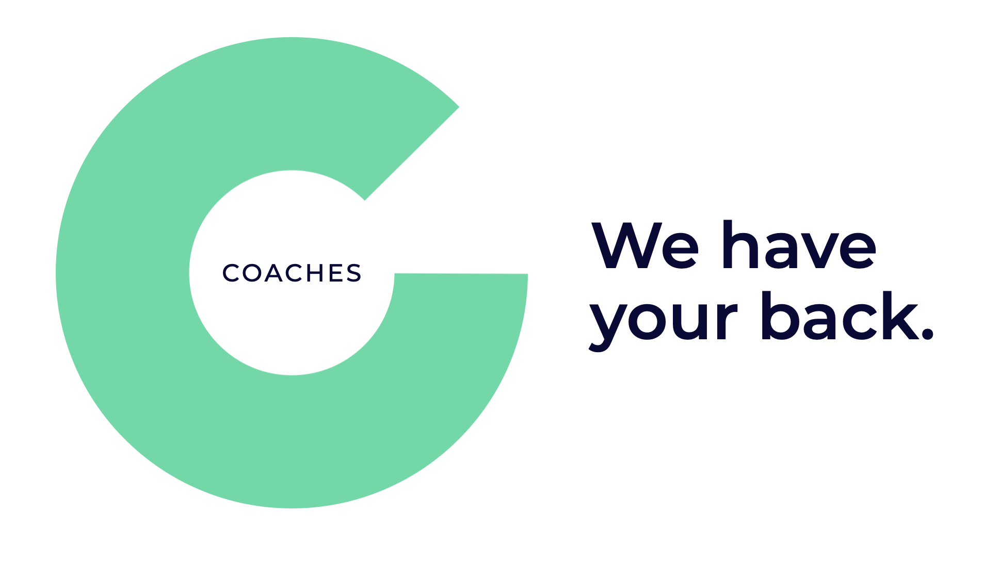

# Welcome to osoc!

This wiki has been created as a _guideline_ for participants of osoc: students, coaches, organisations and volunteers.

## What everybody should know before we start; students, coaches and clients alike!

* [What we are like: the Code of Conduct](code-of-conduct.md)
* [How we work: The Osoc Way of Work & Play](way-of-work/)

You're always free to break the rules; as long as you're trying to make it a better experience!

* [Student specific information](./#students)
* [Coaches specific information](./#coaches)
* [Organisations specific information](./#organisations-partners-clients)

### Students

Oof, you're in for a treat! We are super excited to meet you on 6 July...

* If you have any practical questions, head over to [Practical: When, where, how long, food, sick days, ...](students/being-a-student-at-osoc/attend.md) and [Salary & Reimbursements](students/reimbursements.md)
* Wondering what you'll be doing?
  * Get a broad idea at [Practical: When, where, how long, food, sick days, ...](students/being-a-student-at-osoc/attend.md)
  * Go to the [calendar](organisers/calendar/calendar-remote-edition/) to get a more detailed view of what we'll do do 

See you soon!

### Coaches

Woah, we're so glad we can count on you and your expertise!

* More information about what you'll be doing:
  * To get a broad idea, go to [Soft Skills & Expectations](coaches/the-coaching-job/soft-skills-and-expectations.md).
  * A more detailed overview you can find in [Tasks](coaches/the-coaching-job/tasks.md) and [How to work with partners](coaches/partners.md)
  * And if you want to know what will happen day-by-day go to [calendar](organisers/calendar/calendar-remote-edition/).
  * Before osoc gets started, make sure you take a look at [**How to prepare before osoc**](coaches/the-coaching-job/battle-prep.md)\*\*\*\*
* Student coach? Visit [this page for student coaches](coaches/the-coaching-job/student-coaches.md)

Get your practical information at [Practical: When, where, sick days, ...](coaches/attend.md) and [Salary and reimbursements]().

Any tips or recommendations; we love to hear from you [info@osoc.be](mailto:info@osoc.be)!

### Organisations, partners, clients

Without you, we wouldn't be able to do this! Find more info about what you can expect during osoc at [The Partner's Job](partners/the-partners-job.md).

If you have any tips, recommendations or questions; we love to hear from you [info@osoc.be](mailto:info@osoc.be)!


🚧 This wiki is _always_ under construction — if something is missing or wrong, please contact us at info@osoc.be; and we'll make sure to fix it. 🚧

You are welcome to contribute as well!


## We can't wait to see you!1!!!

