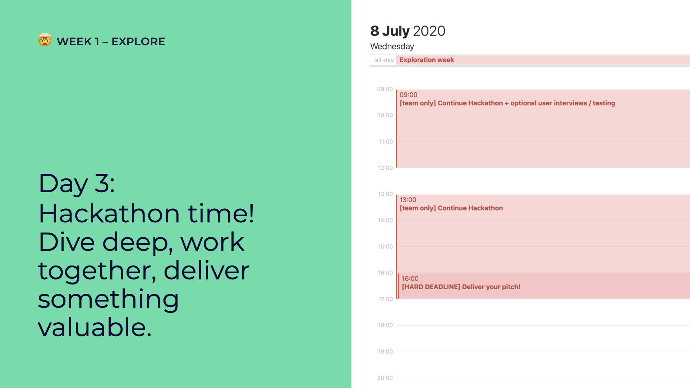

# Day 3: Hackathon & Pitching

## 09:00 \[team breakout only\] Continue Hackathon + optional user testing or interviews

Sync with your team, pick up where you left off and let's continue the hackathon!

Building something? Creating something? Talk to the people you're building it for! You can do user interviews and user tests.

How to conduct user interviews and tests: [Conduct \(Remote\) Tests and Interviews with Real People](../../how-to-conduct-remote-tests-and-interviews-with-real-people.md)

## 13:00 \[team breakout only\] Continue Hackathon

Take the afternoon to round up your hackathon. By 16:00 we expect a video pitch to show off what you've learnt 😏

Keep in mind; the value lies in _learning together_, not in delivering a perfect project.

## 16:00 \[HARD DEADLINE\] Deliver your pitch!

### How to create the pitching video 



### Pitching 

### Deadline 

Put your one-minute pitch video \[slides optional\] in our cloud **by 16:00 in mov or mp4 format**: [https://cloud.openknowledge.be/s/xjW6wXRbdoeXei4](https://cloud.openknowledge.be/s/xjW6wXRbdoeXei4)

Name it after your project name, same as your discord channel!

## 17:00 have a nice day 🥳

