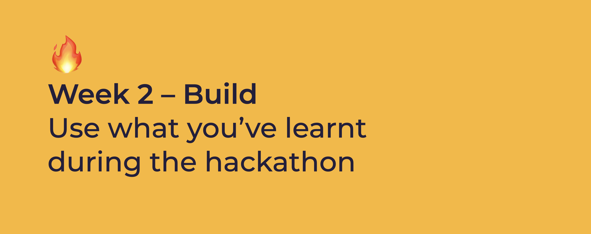

# Week 2: Build

## Goal of the Week

Besides client meetings and pitches, the coming weeks you will spend building, testing, documenting and shipping. It requires teamwork, clear communication and trust to ship something valuable.

Good luck, ask for help when you need it and offer when you can!

* [Day 1](day-1.md#14-00-workshop-how-to-vlog-by-marijn)
* [Day 2](day-2.md)
* [Day 3](day-3.md)
* [Day 4](day-4.md)

