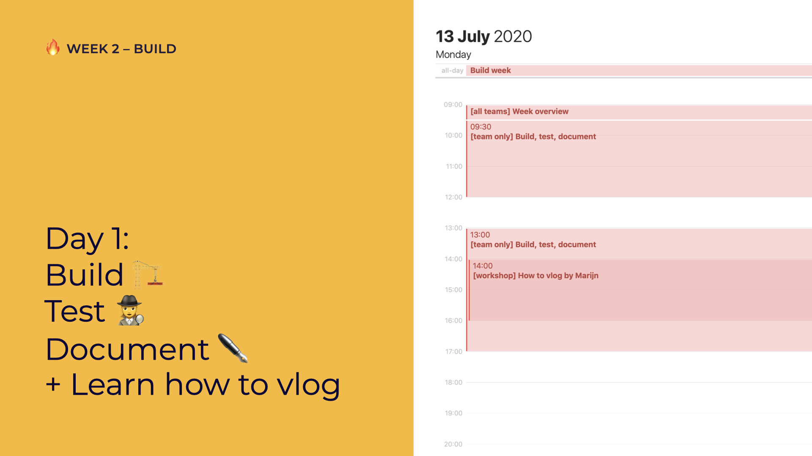

# Day 1: Build, test, document + Learn how to vlog

## 09:00 \[all teams\] Week Overview

Let's go over the week together

## 09:30 \[team only\] Build, test, document

Build what you've defined. Go team!

## 10:00 \[optional talk\] Open Street Map by Pieter Vander Vennet

Our coach Pieter shows you why Open Street Map is cool, why you _should_ use it and _how_ to use it!


Can't attend? Don't worry! You can always watch this talk after work with some 🍿🥤 on our YouTube account.


## 13:00 \[team only\] Build, test, document

Build what you've defined. Go team!

## 14:00 \[optional workshop\] How to vlog by Marijn

Marijn talks about how to vlog: how to film and create nice content + montage!


The entire team can't attend? Don't worry! You can always watch this talk after work with some 🍿🥤 on our YouTube account.  
  
Have one team member attend so they can ask questions if needed.


## 17:00 have a nice day 🥳

