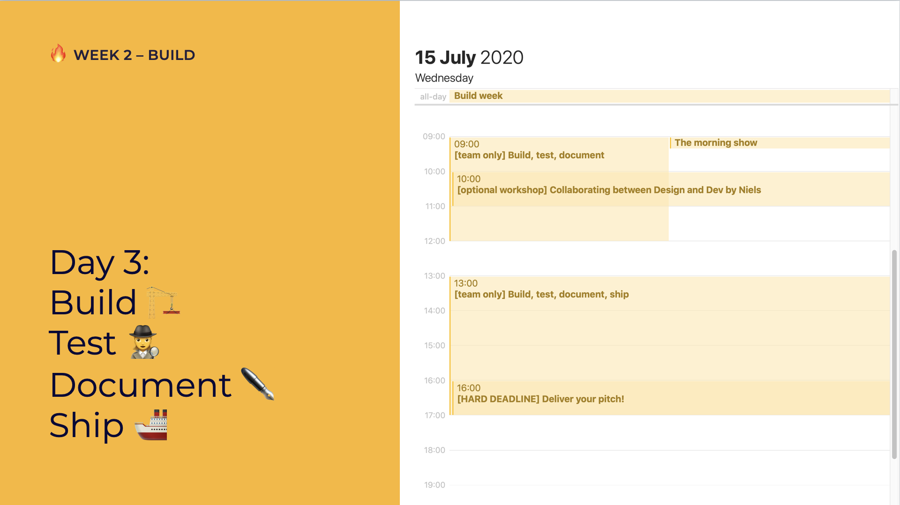

# Day 3: Build, test, document, ship

## 09:00 \[team only\] Build, test, document

Documentation is essential. Make sure you incorporate user interviews and testing 🔥😍

How to conduct user interviews and tests: [Conduct \(Remote\) Tests and Interviews with Real People](../../how-to-conduct-remote-tests-and-interviews-with-real-people.md)

## 13:00 \[team only\] Build, test, document, ship

Ship it real good! Make sure you incorporate user interviews and testing 🔥😍

## 16:00 \[HARD DEADLINE\] Deliver your pitch!

Put your one-minute pitch video \(slides optional\) in our cloud by 16:00:   
[https://cloud.openknowledge.be/s/sJKJGx7nY7qspms](https://cloud.openknowledge.be/s/sJKJGx7nY7qspms)

Your pitch should include:

* Project description
* What you've built
* What you've learnt

## 17:00 have a nice day 🥳

