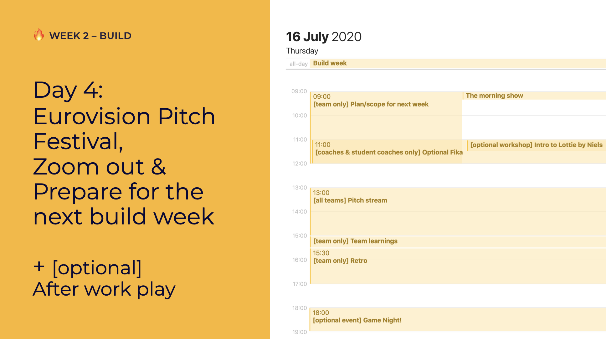

# Day 4: Pitch & Battle Plan

## 09:00 \[team only breakout\] Plan/scope for next week

What are we going to build?

To put all those learnings into action, and to make sure the entire team knows what to expect next week, you can plan what to work on in the next build week.

_Do apply the rule of π!_

## 11:00 \[coaches and student coaches only\] Optional Fika

Talk about what's been going on your team; the good and the bad. 

Tell us:

* how are you doing as a person and as a coach?
* What is not going well in the team?
* What is going well in the team?



## 11:30 \[optional workshop\] Intro to Lottie by Niels

[https://us02web.zoom.us/j/85843098626?pwd=dTZyNkdNRSswZ3dJVGdNV1NYRXFMUT09](https://us02web.zoom.us/j/85843098626?pwd=dTZyNkdNRSswZ3dJVGdNV1NYRXFMUT09)

Meeting ID: 858 4309 8626  
**Password: osoc20**

## 13:00 \[all teams\] Pitch stream

In the morning we will show off all the pitches created by the teams during their teams. Tell us...

* what you liked about each pitch
* what needs work for each pitch \(constructive feedback!\)
* which pitch was the best pitch according to you

## 15:00 \[team only breakout\] Team learnings

You get some time to reflect on the hackathon and on the feedback you got on your pitch.

_What did we learn? How can we work better as a team?_

## 15:30 \[team only breakout\] Retro

Create some room for each other to talk about what's good and what could go better.

Pick a retrospective:

* [http://www.frederikvincx.com/8-sticky-note-walls-keep-team-track/](http://www.frederikvincx.com/8-sticky-note-walls-keep-team-track/) See "retrospective"
* [http://www.funretrospectives.com/](http://www.funretrospectives.com/)

## 17:00 have a nice day 🥳

## \[optional After Work Event\] 18:00 To Be Announced!

