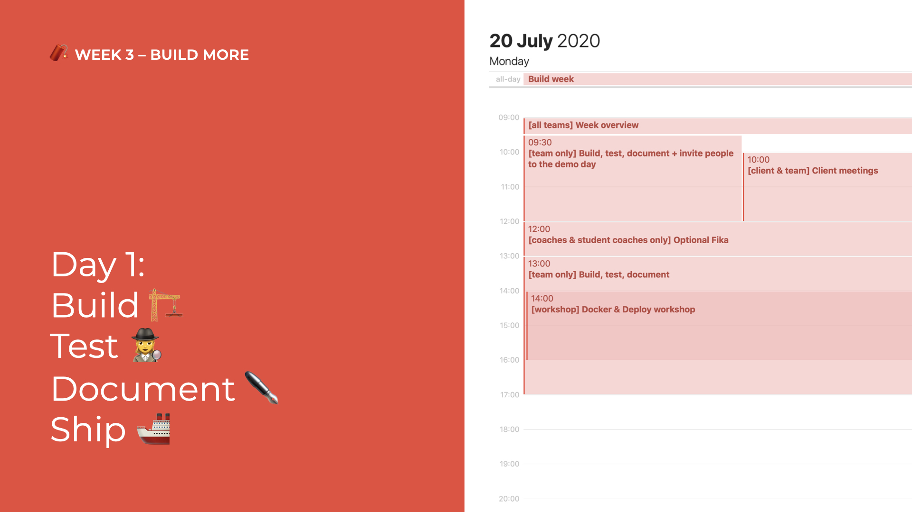

# Day 1: Build, test, document + How to deploy

## 09:00 \[all teams\] Week Overview

Let's go over the week together

## 09:30 \[team only\] Build, test, document + invite people to the demo day

Build what you've defined. Go team!

Make sure possible prospects, friends and loved ones attend the remote edition Demo Day! Link will be shared.

## **10:00 or 11:00** \[client and team\] Client meetings

Depending on the team you are on, you will have a client meeting at 10:00 or 11:00.

We will send out e-mails up front!

If you need more meetings, you are free to book them with the team and client.

## 12:00 \[coaches & student coaches only\] Optional Fika

Talk about what's been going on your team; the good and the bad – in the Fika voice channel &lt;3

## 13:00 \[team only\] Build, test, document, ship

Build what you've defined. Go team!

## 14:00 \[workshop\] Docker & Deployment workshop

For people that want to freshen up their knowledge or have no clue how to get started, attend this workshop.

Depending on your team and coach it's recommended to take this class!

## 17:00 have a nice day 🥳

