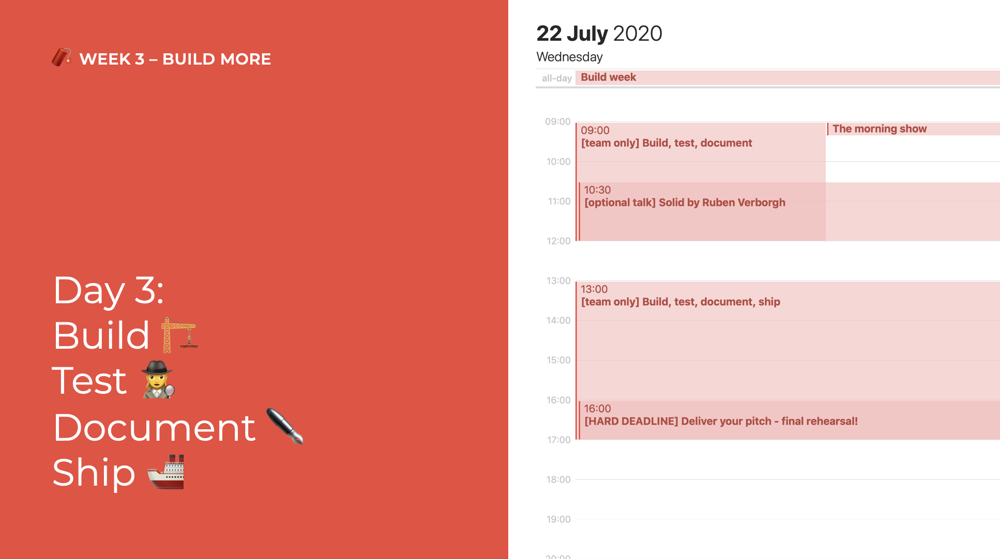
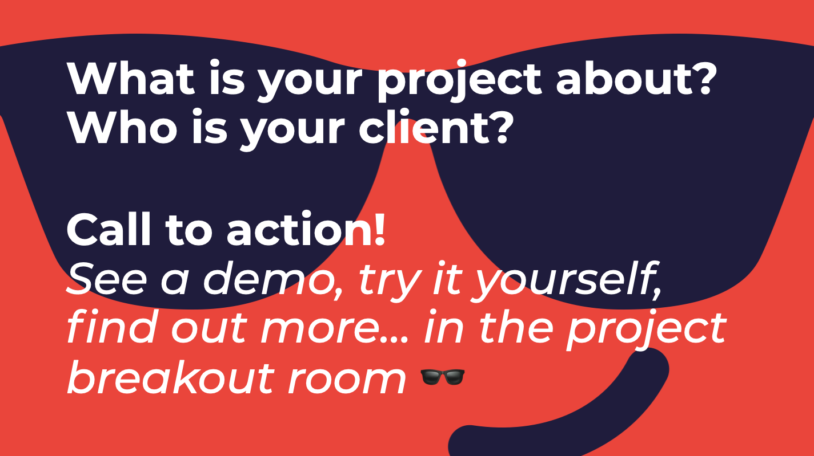

# Day 3: Build, test, document, ship

## 09:00 \[team only\] Build, test, document

Documentation is essential. Make sure you incorporate user interviews and testing 🔥😍

How to conduct user interviews and tests: [Conduct \(Remote\) Tests and Interviews with Real People](../../how-to-conduct-remote-tests-and-interviews-with-real-people.md)

## 09:30 \[optional talk\] Solid by Ruben Verborgh

Time: Jul 22, 2020 09:30 AM Brussels

Join Zoom Meeting [https://us02web.zoom.us/j/89619183473?pwd=RHJ1TzdmZmhXQlM5K3lGZ085dHJaQT09](https://us02web.zoom.us/j/89619183473?pwd=RHJ1TzdmZmhXQlM5K3lGZ085dHJaQT09)

Password: will be shared on discord.


Got other things to do with your team? Don't worry, it will be saved to our YouTube account! You can watch later, after work with some 🍿🥤.


## 13:00 \[team only\] Build, test, document, ship

Ship it real good! Make sure you incorporate user interviews and testing 🔥😍

## 16:00 \[HARD DEADLINE\] Deliver your pitch!

MAKE IT LIKE IT'S DEMO DAY!

Put your one-minute pitch video \(with slides\) in our cloud **by 16:00**: 

[https://cloud.openknowledge.be/s/z4Qc3866rg5MF7K](https://cloud.openknowledge.be/s/z4Qc3866rg5MF7K)

Your pitch should include:

* Project description
  * Make it demo-day-ready!
* Who is your client
* Give us a Call-To-Action!

## 17:00 have a nice day 🥳

