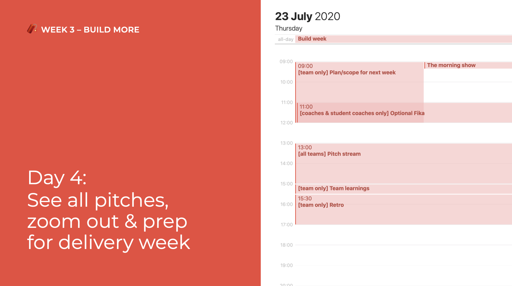

# Day 4: Pitch & Battle Plan

## Prepare for the Pitching Rehearsal: Instructions

### During the pitches, when your team _is not_ up

We show 3 pitches, and then interview 3 teams.  
Sit back and enjoy 🤩! Show ♥️ and give feedback in \#pitch-chat.

### During the pitches, when your team _is_ up

1. We'll show 3 pitches of 3 teams \([sequence found here](https://docs.google.com/spreadsheets/d/1LEOFnsOYX1sOJuNBzhD277bCgdci9O_vAOphsx2vnGE/edit?usp=sharing)\)
2. After those 3 pitches we'll **ask one team member** of each team we just saw **to answer one question**.
3. The three representatives of those teams go to the waiting room when their pitch is up.
4. They'll be introduced to the pitch arena, where they answer the question.
5. Leave when the 3 team representatives have answered the question 😘.

#### How to prepare:

* Select **one team member** of your team.
* That team member **prepares a** _**very short**_ **answer to that question**.
* **Write down** the team member and answer here: [https://docs.google.com/spreadsheets/d/1LEOFnsOYX1sOJuNBzhD277bCgdci9O\_vAOphsx2vnGE/edit?usp=sharing](https://docs.google.com/spreadsheets/d/1LEOFnsOYX1sOJuNBzhD277bCgdci9O_vAOphsx2vnGE/edit?usp=sharing)

_Example:_

* _Pitches of Team 1 \(Bridges\), 2 \(ArTIFFact Control\) and 3 \(Simplification of election procedures\) are shown_
* _Representatives of Team 1, 2 and 3 go to the waiting room during those pitches._
* _Representatives of Team 1, 2 and 3 are introduced to the pitch area, and answer the question in that sequence._
* _They all leave at once when the answers have been given._
* _Next team pitches: 4, 5 and 6. During those pitches their representatives go to the waiting toom._

### After the Pitches: Project Breakouts

After the pitches, you get the opportunity to discover more and perhaps view demos 😻.

The selected teams show demos or give more information, other teams can roam & discover! Recommended when roaming: switch every 5 minutes 😉

#### Select a Host

Your job is to make things go _smoooooth_. [Write down who will](https://docs.google.com/spreadsheets/d/1LEOFnsOYX1sOJuNBzhD277bCgdci9O_vAOphsx2vnGE/edit?usp=sharing).

1. **Go to the breakout room first** to get moderator rights. _Keep it open in your browser tab from the moment the pitch stream starts_ 😁 __
2. **Mute** visitors _Only people that are presenting or ask questions should have their mics on._
3. Ask visitors to **write down** questions.
4. **Read those questions out loud & invite the writer to speak** whenever their question gets addressed, so they can have a conversation.
5. Something wrong? Have someone **report** to Miet in \#practical-questions. 
6. _If you have no visitors, think of a game you can play 😁 👯‍👯_

#### 0-15 mins: Teams 1-9

* Selected teams demo and answer questions.
  * **1** Bridges [meet.openknowledge.be/1](http://meet.openknowledge.be/1)
  * **2** ArTIFFact Control [meet.openknowledge.be/2](http://meet.openknowledge.be/2)
  * **3** Simplification of election procedures [meet.openknowledge.be/3](http://meet.openknowledge.be/3)
  * **4** BetterBikeBrussels [meet.openknowledge.be/4](http://meet.openknowledge.be/4) 
  * **5** WalkByBrussels [meet.openknowledge.be/5](http://meet.openknowledge.be/5)
  * **6** Urban Brussels [meet.openknowledge.be/6](http://meet.openknowledge.be/6) 
  * **7** Fitigai [meet.openknowledge.be/7](http://meet.openknowledge.be/7) 
  * **8** Comms Team [meet.openknowledge.be/8](http://meet.openknowledge.be/8) 
  * **9** NMBS Route Planner [meet.openknowledge.be/9](http://meet.openknowledge.be/9) 

#### 15-30 mins: Teams 10-19

* **10** Serendipity Engine [meet.openknowledge.be/10](http://meet.openknowledge.be/10)
* **11** Bike Data Project [meet.openknowledge.be/11](http://meet.openknowledge.be/11)
* **12** Cyclofix [meet.openknowledge.be/12](http://meet.openknowledge.be/12)
* **13** Fast and Slow [meet.openknowledge.be/13](http://meet.openknowledge.be/13)
* **14** FRIS [meet.openknowledge.be/14](https://meet.openknowledge.be/14)
* **15** Job match [meet.openknowledge.be/15](http://meet.openknowledge.be/15)
* **16** Shmdoc [meet.openknowledge.be/16](http://meet.openknowledge.be/16)
* **17** RML.io Dashboard [meet.openknowledge.be/17](http://meet.openknowledge.be/17)
* **18** Get Engaged [meet.openknowledge.be/18](http://meet.openknowledge.be/18)
* **19** Bitoftrust [meet.openknowledge.be/19](http://meet.openknowledge.be/19)

## 09:00 \[team only breakout\] Plan/scope for Delivery Week

_Do apply the rule of π!_

## ~~11:00 \[coaches and student coaches only\] Optional Fika~~

Cancelled due to hard work!

## 13:00 \[all teams\] Pitch stream

We will show off all of our pitches! Go to the [instructions](day-4.md#prepare-for-the-pitching-rehearsal-instructions) to see what needs to happen.

## 15:00 \[team only breakout\] Team learnings

You get some time to reflect on the hackathon and on the feedback you got on your pitch.

_What did we learn? How can we work better as a team?_

## 15:30 \[team only breakout\] Retro

Create some room for each other to talk about what's good and what could go better. [A 7-minute tutorial](../../how-to-manage-a-team.md#how-to-vent-improve-and-replenish-the-team-with-a-team-retrospective).

Pick a retrospective:

* [http://www.frederikvincx.com/8-sticky-note-walls-keep-team-track/](http://www.frederikvincx.com/8-sticky-note-walls-keep-team-track/) See "retrospective"
* [http://www.funretrospectives.com/](http://www.funretrospectives.com/)

## 17:00 have a nice day 🥳

## \[optional After Work Event\] 18:00 Movie Night

