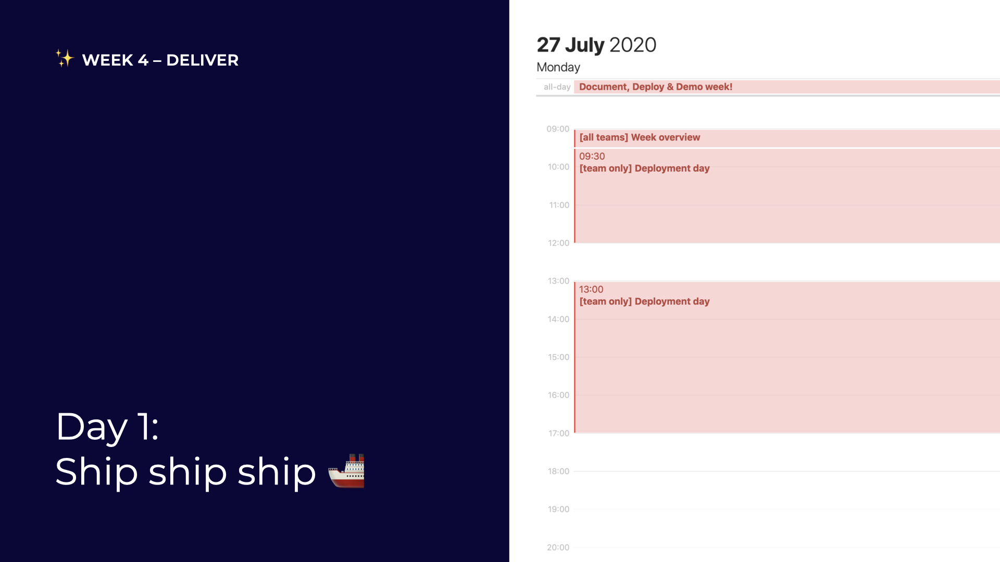

# Day 1: Ship ship ship

## 09:00 \[all teams\] Week overview

Let's go over the week together

## 09:30 \[team only\] Deployment day

Make sure your project is stable and shipped!

## 13:00 \[team only\] Deployment day

Make sure your project is stable and shipped!

## 17:00 have a nice day 🥳

