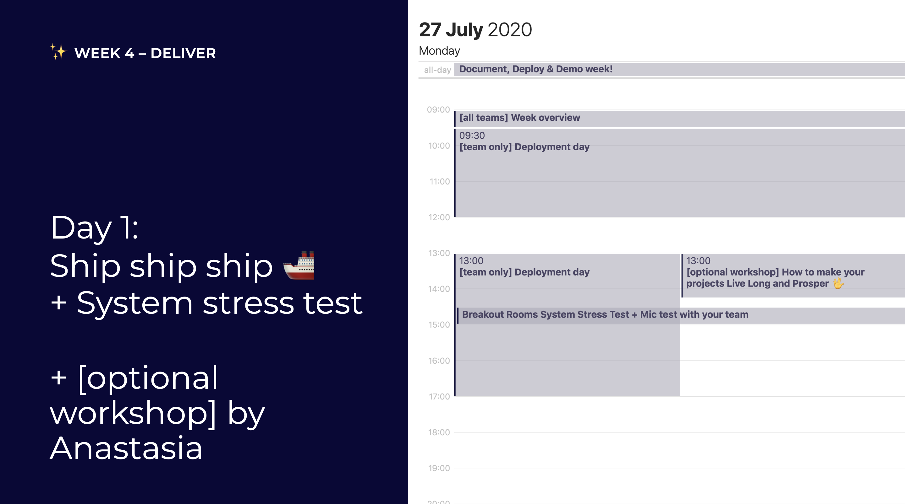
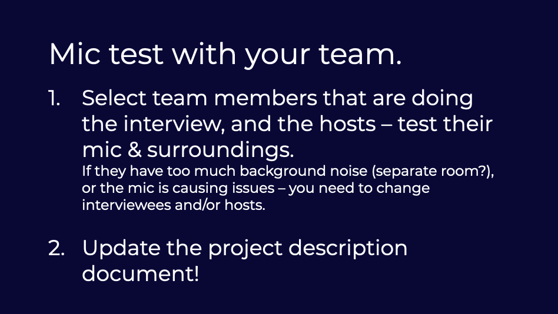

# Day 1: Ship ship ship

## 09:00 \[all teams\] Week overview

Let's go over the week together

## 09:30 \[team only\] Deployment day

Make sure your project is stable and shipped!

## 13:00 \[optional workshop\] Handover Dossier input: How to make your projects Live Long & Prosper 🖖

It's DELIVERY week, and we all know that everything is...? ON FIRE 🔥!

But before you set stuff on fire, think about what happens after this last week, and especially what happens to your "baby"? Longevity of the project depends on how you define your and team dynamic looking forward.

This workshop will give you input for your [Handover Dossier](../../how-to-deliver-like-a-pro/).

## 13:00 \[team only\] Deployment day

Make sure your project is stable and shipped!

## 14:30 \[all teams\] SYSTEM STRESS TEST

We want to make sure Jitsi will hold up when we are doing the project breakout rooms, and your mics will hold up during the demo day

### 1. Jitsi stress test + chance to scream


We all meet in 1 [jitsi room](https://meet.openknowledge.be/vent), with our **cams on** and... scream, sob, complain, laugh hysterically, swear, sing – for 1 minute ^^  
  
Don't have a mic or a cam? Come over anyways! Every extra test is a good one 👌




### 2. Mic test

Check if your interviewees and hosts will make a good appearance on the demo day stream;

* Limited background noise
* Stable microphone

And update the project description sheet with hosts and interviewees for the Demo Day: [https://docs.google.com/spreadsheets/d/1LEOFnsOYX1sOJuNBzhD277bCgdci9O\_vAOphsx2vnGE/edit?usp=sharing](https://docs.google.com/spreadsheets/d/1LEOFnsOYX1sOJuNBzhD277bCgdci9O_vAOphsx2vnGE/edit?usp=sharing)

## 17:00 have a nice day 🥳

