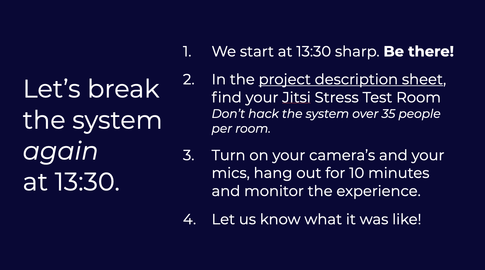

# Day 2: Pitch pitch pitch

## 09:00 \[team only\] Create your Demo Day pitch 🥳

Last pitch to create; make it count!

## ~~11:00 \[coaches & student coaches only\] Optional Fika~~

Cancelled due to other priorities –we have retro's planned this week to replace.

## 13:00 \[HARD DEADLINE\] Deliver your _final_ pitch!

Demo Day Pitch! Whoop!

Put your one-minute pitch video \(slides optional\) in our **DRIVE \(we have migrated\)** by 13:00: [https://drive.google.com/drive/folders/1I2GqIO9YJAbySfwkuNNpEZaKgC0nyD\_e?usp=sharing](https://drive.google.com/drive/folders/1I2GqIO9YJAbySfwkuNNpEZaKgC0nyD_e?usp=sharing)


Please warn Miet if you'll be later than 13:00.


### Update the project description document

Update the host and interviewee in the spreadsheets: [https://docs.google.com/spreadsheets/d/1LEOFnsOYX1sOJuNBzhD277bCgdci9O\_vAOphsx2vnGE/edit\#gid=0](https://docs.google.com/spreadsheets/d/1LEOFnsOYX1sOJuNBzhD277bCgdci9O_vAOphsx2vnGE/edit#gid=0)


Host instructions coming


Your pitch should include:

* Project description
  * Make it demo-day-ready!
* Who is your client
* Give us a Call-To-Action, tell us why to come to your project breakout room!

## 13:00 \[team only\] Documentation, site, handover document, ... 

Don't worry, we'll teach you how to deliver like a pro \[[tutorial](../../how-to-deliver-like-a-pro/)\]!

## 13:30 \[hosts and interviewees\] Run through + mic check with Miet + Stress test 2

To make sure the demo day will go _smoooooth_ 

## \[student coaches only\] Student Coach Retro

We would love to hear your feedback. If you really can't make it, we'll send the questions afterwards.

We meet via Discord \(or via Zoom, depending on the load!\)

## 17:00 have a nice day 🥳

