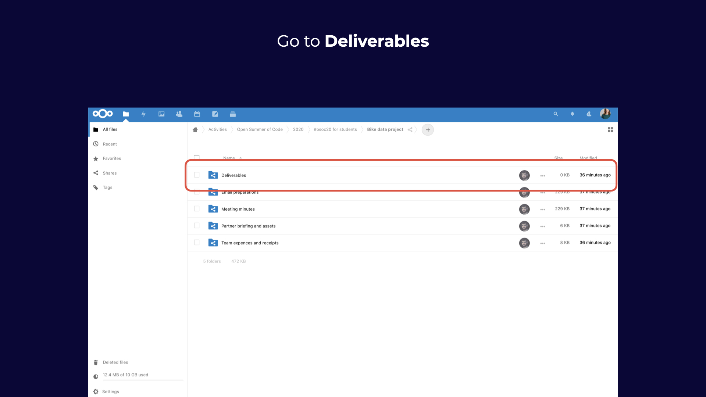

# Day 2: Pitch pitch pitch

## 09:00 \[team only\] Create your Demo Day pitch 🥳

Last pitch to create; make it count!

## 12:00 \[coaches & student coaches only\] Optional Fika

Talk about what's been going on your team; the good and the bad.



## 13:00 \[HARD DEADLINE\] Deliver your pitch!

Demo Day Pitch! Whoop!

Put your one-minute pitch video \(slides optional\) in our cloud by 16:00: [https://cloud.openknowledge.be/s/sJKJGx7nY7qspms](https://cloud.openknowledge.be/s/nsJwzoM5AXwezAk)

Your pitch should include:

* Project description
* What you've built
* What you've learnt

## 13:00 \[team only\] Documentation, site, handover document, ... 

Make sure you have everything in your team folder, described in the handover document. [https://cloud.openknowledge.be/s/8QHH7oXRSWpY8eK](https://cloud.openknowledge.be/s/8QHH7oXRSWpY8eK)

Step 1: Go to the cloud **folder for students** [https://cloud.openknowledge.be/s/8QHH7oXRSWpY8eK](https://cloud.openknowledge.be/s/8QHH7oXRSWpY8eK)

Step 2: Go to **Deliverables**

Step 3: find the deliverables **checklist**

Step 4: Start **checking** boxes!

## 17:00 have a nice day 🥳

