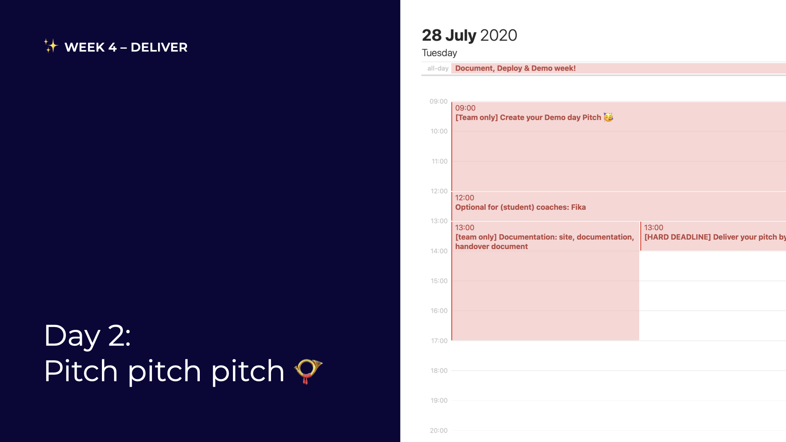

# Day 2: Pitch pitch pitch

## 09:00 \[team only\] Create your Demo Day pitch 🥳

Last pitch to create; make it count!

## 11:00 \[coaches & student coaches only\] Optional Fika

Tell us:

* How are you doing as a person and as a coach?
* What is **not** going well in the team?
* What **is** going well in the team?



## 13:00 \[HARD DEADLINE\] Deliver your pitch!

Demo Day Pitch! Whoop!

Put your one-minute pitch video \(slides optional\) in our cloud by 16:00: [https://cloud.openknowledge.be/s/sJKJGx7nY7qspms](https://cloud.openknowledge.be/s/nsJwzoM5AXwezAk)

Your pitch should include:

* Project description
* What you've built
* What you've learnt

## 13:00 \[team only\] Documentation, site, handover document, ... 

Don't worry, we'll teach you how to deliver like a pro \[[tutorial](../../how-to-deliver-like-a-pro/)\]!

## 17:00 have a nice day 🥳

