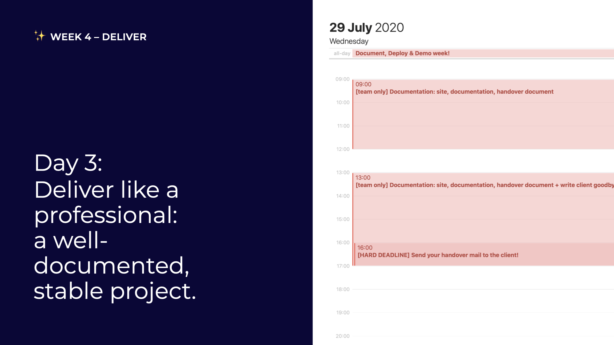

# Day 3: Delivery Day

## 09:00 \[team only\] Documentation, site, handover document, ... 

Make sure you have everything in your team folder, described in the handover document. [https://cloud.openknowledge.be/s/8QHH7oXRSWpY8eK](https://cloud.openknowledge.be/s/8QHH7oXRSWpY8eK)

## 13:00 \[team only\] Documentation, site, handover document, ... + Write client goodbye mail

Make sure you have everything in your team folder, described in the handover document. [https://cloud.openknowledge.be/s/8QHH7oXRSWpY8eK](https://cloud.openknowledge.be/s/8QHH7oXRSWpY8eK)

Write a professional email to thank everyone, and deliver what you've made with the team!

## 16:00 \[HARD DEADLINE\] Send your handover mail to the client!

Like a pro 😎 

## 17:00 have a nice day 🥳

