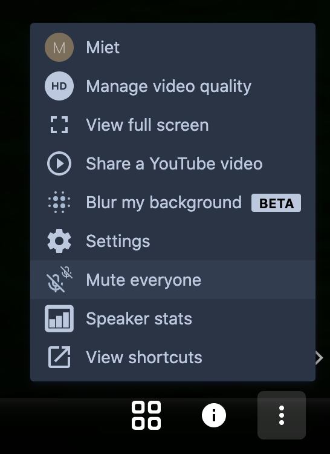

# Day 4: Demo Day

## 09:00 \[team only\] Everything is on fire

If something went terribly wrong... You can still fix it now 😬

## Right after the Morning Show: final run-through

The first run-through this week didn't go as smooth as we liked, so we'll try again to make sure we'll feel confident in the afternoon!

## 11:00 \[team only\] Team Goodbyes

Time to say goodbye to your team and give each other some feedback... 🥰

## 13:00 \[the world\] Demo day! Show your pitches to the world!

Showtime 🤹🏾‍♀️



### During the pitches, when your team _is not_ up

We show 3 pitches, and then interview 3 teams.  
Sit back and enjoy 🤩! Show ♥️in the **YouTube stream** – ask questions in the discord channel **\#pitch-chat**.

### During the pitches, when your team _is_ up

Go to the [Interviews page](interviews.md) to see what will happen and how to prepare.

## 14:30 \[the world\] Project breakout rooms

People can come over to breakout rooms and have a chat with the different teams!

### **What hosting a breakout room looks like**


During the first breakout room test it was clear this job can get quite heavy; so you can definitely split up tasks over your team members and coach\(es\)!


#### Moderating the breakout room

Make sure one person in your team is in the breakout room _first –_ you'll see you get moderator rights.

**Make sure people make themselves recognisable**

**Keep the room quiet**

Very convenient: you can make sure everyone starts out muted.

If someone forgets to mute themselves, you can mute them:  

_Tip: You can already go there when the streaming event starts, so you have the chance to chase out the trolls._

#### Moderating the Questions

How would you approach role division in a break out? How many members of your teams should remain in the break out room? Can it all be done by one person? Like pitching, MC'ing and moderating \(muting people, seeing which relevant questions there are\), showing demo tools answering questions? Seems like a lot to handle

**BREAKOUT ROOMS PART 1**  
15 mins – Switch between the rooms below!

* 1 Bridges [https://meet.openknowledge.be/1](https://meet.openknowledge.be/1)
* 2 ArTIFFact Control [https://meet.openknowledge.be/2](https://meet.openknowledge.be/2)
* 3 Simplification of election procedures [https://meet.openknowledge.be/3](https://meet.openknowledge.be/3)
* 4 BetterBikeBrussels [https://meet.openknowledge.be/4](https://meet.openknowledge.be/4)

**BREAKOUT ROOMS PART 2**  
15 mins – Switch between the rooms below!

* 5 WalkByBrussels [https://meet.openknowledge.be/5](https://meet.openknowledge.be/5)
* 6 Urban Brussels [https://meet.openknowledge.be/6](https://meet.openknowledge.be/6)
* 7 Fitigai [https://meet.openknowledge.be/7](https://meet.openknowledge.be/7)
* 8 Comms Team [https://meet.openknowledge.be/8](https://meet.openknowledge.be/8)
* 9 NMBS Route Planner [https://meet.openknowledge.be/9](https://meet.openknowledge.be/9)

**BREAKOUT ROOMS PART 3**  
15 mins – Switch between the rooms below!

* 10 Serendipity Engine [https://meet.openknowledge.be/10](https://meet.openknowledge.be/10)
* 11 Bike Data Project [https://meet.openknowledge.be/11](https://meet.openknowledge.be/11)
* 12 Cyclofix [https://meet.openknowledge.be/12](https://meet.openknowledge.be/12)
* 13 Fast and Slow [https://meet.openknowledge.be/13](https://meet.openknowledge.be/13)
* 14 FRIS [https://meet.openknowledge.be/14](https://meet.openknowledge.be/14)

**BREAKOUT ROOMS PART 4**  
15 mins – Switch between the rooms below!

* 15 Job match [https://meet.openknowledge.be/15](https://meet.openknowledge.be/15)
* 16 Shmdoc [https://meet.openknowledge.be/16](https://meet.openknowledge.be/16)
* 17 RML.io Dashboard [https://meet.openknowledge.be/17](https://meet.openknowledge.be/17)
* 18 Get Engaged [https://meet.openknowledge.be/18](https://meet.openknowledge.be/18)
* 19 Bitoftrust [https://meet.openknowledge.be/19](https://meet.openknowledge.be/19)

## 15:30 \[all teams\] Goodbye...

Time to say goodbye to everyone!

