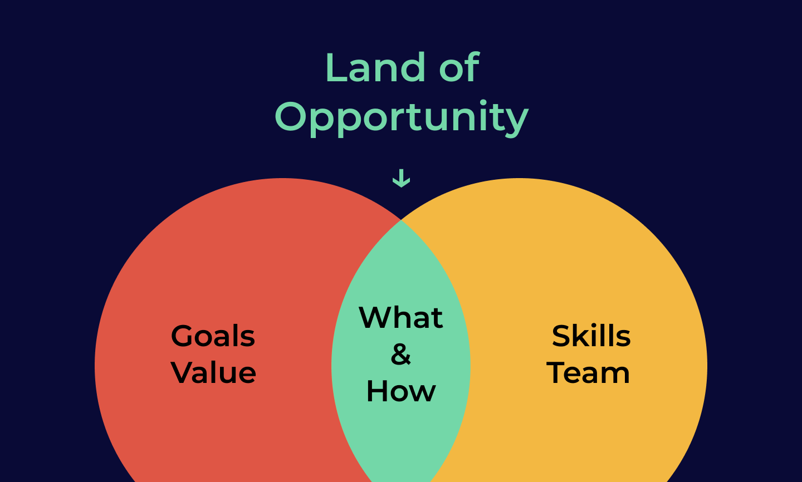

# Coaching Cases


Together with coach Jodi, we've set out a couple of guidelines and cases you can use to guide your students with. Have an edge case? Get in touch!


Coaching teams is balancing between **thinking and doing.  
Why are we building this?** \(what is the goal, what would be valuable, where are we going long term, for whom, ...\)  
**How are we building this?** \(team, skills, tools, technology, data at hand, ...\)  
  
The answer to "**What is possible?**" lies in between the answers to those questions – and opens a ✨land of opportunity ✨.

## Get To Know Your Team

Use the first days of osoc to do this. Everything depends on the people you have in your team. Their skills will decide where you can meet the partner's needs. Find techniques on [breaking the ice here](how-to-manage-a-team.md#ice-breakers), and move forward with finding out about the next topics:

* **Get to know what your team members' skills are**
* **Get a grasp on what level they are on**
* **Assess what people like to do and where they want to learn** \(maybe even what they do not want to learn\) 
* **Discover what they need help with** \(it's possible that they don't know yet!\)

Starting from there, you can figure out who can take responsibility for what; and where the pitfalls might be. You can try to figure out who can _study up_ or find other solutions \(finding help in the \#help channels for instance – or pivot in execution\).

Inform the partner about what you can and what you cannot do as a team. This will help them adjust their expectations accordingly.

* **Define responsibilities**
* **Define how to fill the gaps**
* **Inform the partner**


**We've all done our utter best to select students that will fit the project.**  
Teams will consist out of different people with different skill levels – which allows them to learn from each other too \(like coaching and teaching other students, or learning from someone with more experience\) – with a lot of enthusiasm.  
**They'll all do their best, but it's possible some expectations will** _**not**_ **be met.**


### Adapt your coaching style

All teams will needs help with project management \(see "[Set up a good routine](coaching-cases.md#week-1-4-set-up-a-good-routine)"\). Depending on how your team works together, their experience and confidence level, you can adjust your coaching style – based on the [previous assessment](coaching-cases.md#getting-to-know-the-team) – but don't be afraid to switch it up if needed in the weeks after.

* **Offer support and guidance in executing their role if needed**

  _Students with \(a\) little \(less\) experience in working on actual projects will need support with finding their way around their "assigned role" \(code, design, communication, research...\)_  
  Really show them how certain tools work, how to go about it, _help creating_ the project. The students still have to do the work, but take the time to show them around or look for someone who can.  
  
  The team members of this group will definitely do a better job next year already. An experienced and confident team will need less support here.  

* **Emotional Support & Soft Skills**  
  _Student that have \(a\) little \(less\) experience in working in teams or that lack in confidence will need to feel supported by you and their other team members – but even experienced students need that confidence boost now and then._

  Focus on relationship-building in your team:

  * **Sharing struggles & successes**: will help people relate to each other. 
  * **Showing compassion and empathy towards each other's learning journey**: will support an environment where it's okay to fail and learn.
  * **Helping each other out**: will create opportunities to feel supported.
  * **Celebrating that support**: will emphasise a positive team culture.
  * **Supporting collaboration over personal wins**: more brains and more perspectives will deliver higher quality in the long term.
  * **Giving pep talks**: sometimes people just need to know they'll be fine. Because they will be. They can be proud of what they're doing.  Don't be shy in investing time in this. The _vibe_ of your team will reflect in their energy and in the end-result they created together! 

* **Challenging strong students** If you have students in your team that feel confident of their skills, and already lean towards taking more responsibility, you can challenge. Some examples:
  * **Client management** \(let them take the lead at a client meeting and support when needed, let them send emails, ...\)
  * **Project management** \(let them lead a stand-up, take over when you're not there, report to coaches about the team, ...\)
  * **Code Architecture & Set-up** \(give them ownership – and feedback – about how to set up the code environment, who will do what and how will they make things work\)
  * **Design set-up** \(have them decide will we use Figma or Sketch, how will we share designs with fellow designers or developers, ...\)
  * ... **be creative**! Students will surprise you with their talents. 
* **Healthy boundaries** – even confident, well-functioning teams need them. 

  The biggest pit-fall for strong teams is not over-working. While you definitely encourage learning and challenging each other, it's important to not overstep and set realistic goals.  

* **Pitching** is a big part of osoc. It's a useful skill to have, for any profile. Everyone needs to be able to show what they've created, and apply for a job some time! So don't just dump it on your communication students only.  Some people need a little push and a confidence boost to try, but if your students start to panic, it might not be the time for them.

## Get to Know Your Partner & Project

Different projects require different approaches. In any case, we want students to thoroughly think about the project and the approach. We don't want any student to just execute what is thrown at them, we want them to use their brains to study the subject and ask critical questions.

_"Who are we creating this for? What is the goal? Why would they need it? What would be most valuable? What is the long-term vision?"_  
You can use [brainstorm](how-to-manage-a-team.md#3-brainstorm-ideas-2-bonus-adaptions) and [scoping sessions](how-to-manage-a-team.md#how-to-do-a-scoping-session) to facilitate these questions, and diverge and converge techniques. You'd want to interview the partner as a team, and get to the bottom of the problem they want to solve – and involve the client.

We've made sure you can see your client every Tuesday to have a conference call, but don't be afraid to send them \(with everyone in cc\) an email now and then.

### Abstract, visionary projects

_AKA "Niels Projects"_

Abstract projects give you and your team a lot of freedom. "Here's a dataset. Go!" – "I have an idea.. make some fuss about it. Go!". Partners usually want to create some buzz around a topic, and want something cool to show in the end.

These projects require more attention for the ideation phase – to know what you'll be creating for _who_ and _why_.

#### **Deliverables**

These projects usually deliver proof of concepts, clickable prototypes, a paper with research, an approach of how to bring something to market, a convincing pitch for a management team... **the** _**why,**_ **the** _**concept, research, interviews, learnings, scenario's, pitches ..**_ **are part of the deliverable – besides the proof of concept / marketing stunt / ... you'll be presenting.**

#### **Timing Note**

These teams usually spend a lot more time in brainstorms and will pivot a couple more times in their approach than teams with a concrete solution. Make sure by week 2 you've **strategised, done those user interviews, wrote down all those explored scenario's, approaches and learnings**, so you can double down on that prototype / mock-up / paper / ... in week three. Pick the approach everyone feels most comfortable and push through the hurdles that it throws at you– sometimes you have to make a decision and roll with it.

#### **Approach**

Make sure your team also gets to _create things_ in time. **Balance your team activities**, for instance; do a brainstorm before noon with the team, and let them do their technical set-up \(with docker\) / create a mood board / create a UI-kit / set up their communication plan / ... in the afternoon. **Assure your team that it's okay not to code/design/.. immediately and that the discovery is part of the deliverable.** This will also give you room to breathe.

It's easy to get lost in abstract projects, so make sure everyone knows what to do after they're done with something else. The vision, supporting other students and regular stand-ups will help you out here.

#### **Client Involvement**

**Brainstorming together about "the bigger picture" with your partner** might be useful the first week-and-a-half. They'll give you a ton of ideas. If they don't, you can take the lead here and present them cases for them to give feedback on. Make sure you do **show confidence when you make a choice in concepts, because you want your team to have time to build something** _**concrete**_ ****in the end as well.

### **Concrete projects**

_AKA "VLIZ & Pieter projects"_

Partners like VLIZ usually know really well where they want to go, and how it should be executed. They know who the project is for, why, how it's valuable and what technologies to use. 

#### **Deliverables**

These teams usually deliver projectes that are ready for production – or to prove something is _possible_ \(letting people use it, test a technology, propose it to a management team, ...\). Quite often, our partners will use the code, designs and communications in their day-to-day projects, or they'll use it as a proof of concept to start building themselves. **The code, designs, communication strategies and pitches etc. are part of the deliverable.** The how and why needs to be understood to deliver this.

#### **Timing Note**

These teams usually spend more time exploring technical challenges, within their role, and understanding _how_ people would interact with this project. You would want them to create things as soon as possible; and conduct **tests** and **user tests** \(more than user interviews\).

In the beginning, work with mock-ups and proof-of-concepts as much as you can. If you've already committed to a concrete approach in week 1 – it will be much harder to adapt and pivot. Leave room for feedback from clients and users – because there's _always_ the "_ah, I didn't expect this as outcome_"-moment.

You want it to **work,** **work for people, and you want other people to be able to work on the project as well** \(documentation!\).

#### **Approach**

You want your students to understand the why and the how of this project, so they can make the best possible choices. Ask your client to help understand \(for example in a presentation\), and ask your students to ask the right questions \(and support them if needed\). **Take the first week to explore this, and assure everyone this is needed to have this shared understanding.** In this case it's even more important to make sure you know what the absolute minimum is of what the partner needs. This will force everyone to make much-needed choices. If there's time to build extra – that's great. Exactly because they know exactly where to go, feature creep is lurking around the corner.

#### **Client Involvement**

When there's a technical hurdle, it would be wise **involving your partner when looking for solutions** – so that they can also _use_ the solution that your team created in the long run. They'll probably also know best how to approach this.

One of the most important things you need from the client is data and access \(codebases, information\). Without it, students can't do anything. And if you want to do data analysis, you'll need even more data! 

### Mixed projects

_AKA "ABB projects"_

The partners that propose these kinds of projects have a very clear picture of where they want to go, but leave it up to the students how to get there. They give you a lot of freedom, but some things might be set in stone, like for instance "You have to use Linked Open Data." or "We want these people to be convinced of the project.". If you take them down a different road, they won't object.

Big teams can be split up in the [abstract](coaching-cases.md#abstract-visionary-projects) team and the [concrete](coaching-cases.md#concrete-projects) team, but smaller teams can, based on their skills, choose one of either approaches.

If you decide to split up your teams, set up a plan of how you're going to get _back together_. In week 1, they'll probably be exploring separately mostly, starting from the information they got from the client. But from week 2, you'll probably want to make sure they're working towards a shared goal.

## What & How

You now know how to approach your team; and how to adapt along the way if things turn out to be a bit different.

Go to [How to Manage a Team: Techniques](how-to-manage-a-team.md) to get started!

