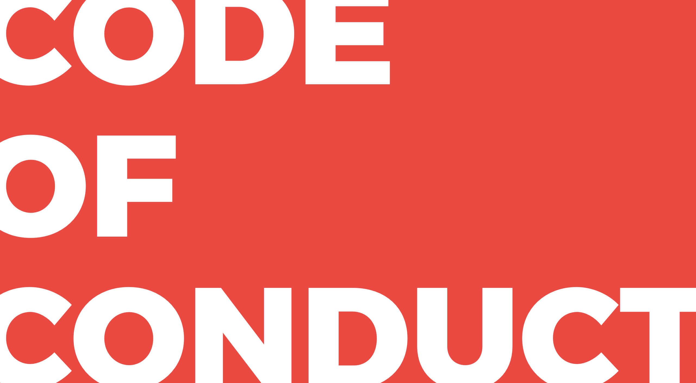

# Code of Conduct

### Our Pledge 

We as members, contributors, and leaders pledge to make participation in our community a harassment-free experience for everyone, regardless of age, body size, visible or invisible disability, ethnicity, sex characteristics, gender identity and expression, level of experience, education, socio-economic status, nationality, personal appearance, race, religion, or sexual identity and orientation.

We pledge to act and interact in ways that contribute to an open, welcoming, diverse, inclusive, and healthy community.

### Our Standards 

Examples of behavior that contributes to a positive environment for our community include:

* Demonstrating empathy and kindness toward other people
* Being respectful of differing opinions, viewpoints, and experiences
* Giving and gracefully accepting constructive feedback
* Accepting responsibility and apologizing to those affected by our mistakes, and learning from the experience
* Focusing on what is best not just for us as individuals, but for the overall community

Examples of unacceptable behavior include:

* The use of sexualized language or imagery, and sexual attention or advances of any kind
* Trolling, insulting or derogatory comments, and personal or political attacks
* Public or private harassment
* Publishing others’ private information, such as a physical or email address, without their explicit permission
* Other conduct which could reasonably be considered inappropriate in a professional setting

### Scope 

This Code of Conduct applies to all students, student coaches, coaches, volunteers and organisations that are part of Open summer of code when interacting with each other and representing our community in public spaces.

### Enforcement 

Instances of abusive, harassing, or otherwise unacceptable behavior may be reported to the coordinators responsible for enforcement at [info@osoc.be](mailto:info@osoc.be). All complaints will be reviewed and investigated promptly and fairly.

Any reporters will remain anonymous.

### Attribution 

This Code of Conduct is adapted from the [Contributor Covenant](https://www.contributor-covenant.org/), version 2.0, available at [https://www.contributor-covenant.org/version/2/0/code\_of\_conduct.html](https://www.contributor-covenant.org/version/2/0/code_of_conduct.html).

Community Impact Guidelines were inspired by [Mozilla’s code of conduct enforcement ladder](https://github.com/mozilla/diversity).

For answers to common questions about this code of conduct, see the FAQ at [https://www.contributor-covenant.org/faq](https://www.contributor-covenant.org/faq). Translations are available at [https://www.contributor-covenant.org/translations](https://www.contributor-covenant.org/translations).

