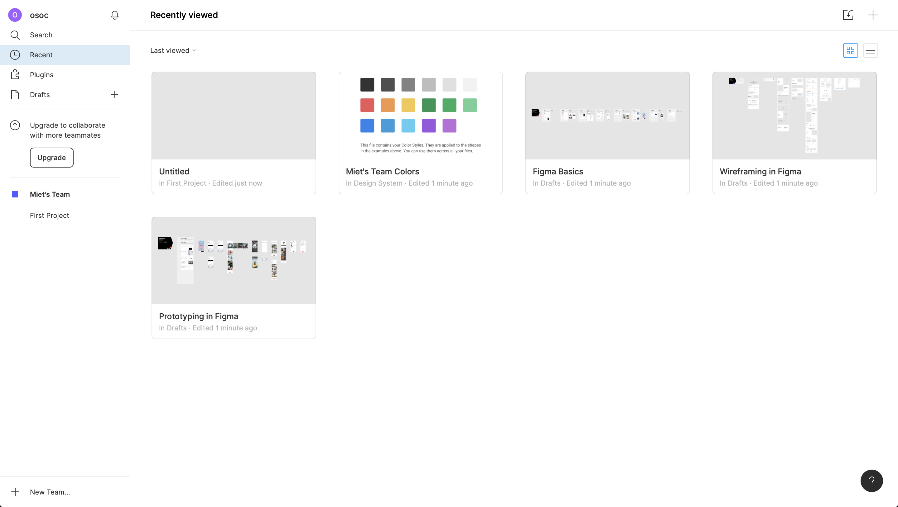
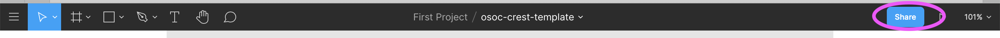
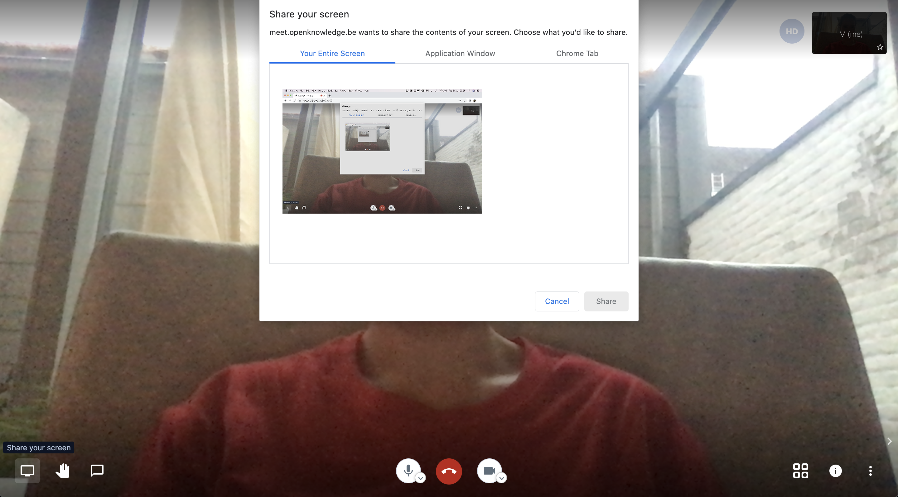
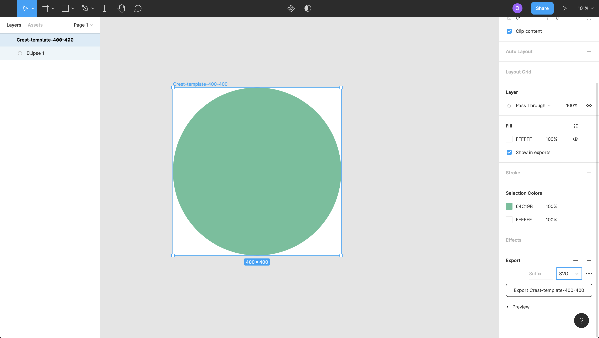
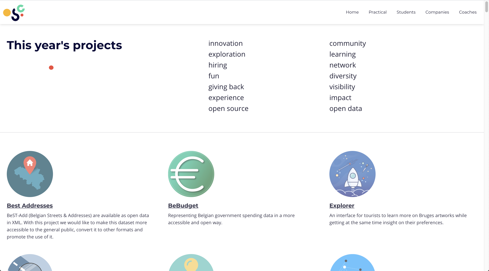

# Create Crests

A glimpse of the 2019 crests [https://osoc.be/editions/2019](https://osoc.be/editions/2019)

## What a crest looks like

* Your crests need to be 400px by 400px
* A [vector](https://en.wikipedia.org/wiki/Scalable_Vector_Graphics), exported as SVG \(so no PNG or JPG\) – which can be created with tools like Figma, Sketch, Illustrator or Adobe Fireworks.


To check if your SVG exported correctly, open it in your browser! Sometimes gradients and opacity can cause some issues.

Depending on the software you're using, there's ways to fix that. Not sure how that works? go to the **Design consult** channel in[ Discord!](tools/discord/)


## Choose the tools you like to create the crest, together

We have no strict rules on what tools you should use. The only restriction is that the output is as described above, and that it's a team effort!

## Option: Use Figma to design your crests together

Figma is a good tool for visual collaboration. It is not the only one, but it works.

### Getting started

Choose who will create the design. [This person can create an account](https://www.figma.com/) and verify their email address. Feel free to use a Figma account you already have, but keep in mind there are restrictions on the amount of collaborative boards you can use.

You can download the discord desktop app at [https://www.figma.com/](https://www.figma.com/). You _can_ use the browser version, but it works a little less fluid.

This is what the board looks like:

### Copy the template

We have prepared a template at [https://www.figma.com/file/Vxqp9O3hg9sA9ItzMpwmPF/osoc-crest-template?node-id=0%3A1](https://www.figma.com/file/Vxqp9O3hg9sA9ItzMpwmPF/osoc-crest-template?node-id=0%3A1) open it and duplicate it to your folder like shown in the image below, or copy it to one of your own boards.

### Share the board with your colleagues

With free subscriptions, you can only add 2 editors and unlimited viewers. So choose wisely who can edit.

Add the colleagues who are allowed to view

Add the colleague who will edit with you

### Collaborate

Go to your breakout room \(shared in advance\), ask someone to share the figma screen and start brainstorming!

### Tips

* Pick colors
  * [https://mycolor.space/](https://mycolor.space/)
  * [https://coolors.co/](https://coolors.co/) \(by Inti\)
* Free vector graphics [https://thenounproject.com/](https://thenounproject.com/)
* Use collaborative tools to work together [https://figma.com/](https://figma.com/)

### Export

Select the artboard and export as SVG \(bottom right\)

### Share

Share your crest in the folder "crests", with the name of your project [https://cloud.openknowledge.be/s/i8FjdnJc3FjkjN8](https://cloud.openknowledge.be/s/i8FjdnJc3FjkjN8)

Afterwards, we'll share you crest, with project description, on our website!

## Alternative options

* You can also choose to use a team member's preferred software and share screens with the team.
* Versioning is possible with tools like [Zeplin](https://zeplin.io), and you can export designs into code immediately!
* Feel free to use and suggest any other workflows 👌

