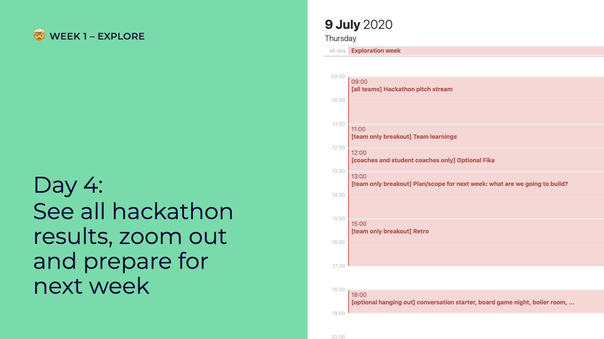

# Day 1: Welcome (to the Madness 😏)


This is an example of the remote edition fo 2020. Go to the website of your specific edition if you want to figure out what's happening now!


## **09:00 \[all teams] Introduction**

Welcome to open summer of code! The topics we'll cover:

* What is osoc?
* What is Open Knowledge Belgium?
* What’s [the code of conduct](../../../../code-of-conduct.md)?
* How does [osoc work](../../../../way-of-work/)?
* Calendar overview
* Deliverables \[[tutorial](../../../../tutorials/how-to-deliver-like-a-pro/)]

## **Get to know your team & your project**

### Who’s who & what do you do?

* Icebreaker; get to know each other!
* Share your skills, talents hobbies, …
* Tell us what you can help other people with

### What are we going to do?

* Study the briefing
  * You can find the briefing in the folder of your team – which will be shared by your coach at the start of the week. Bookmark it!
* Define goal
* Compose list of questions for partner/client

## **13:00 Team & Pitch Prep**

Prepare to introduce yourselves to the other teams!

* Think of a **team name** that reflects your members and project
* Create a **crest** together \[[Find out how](../../../../tutorials/how-to-create-crests.md)]
* Send over **a picture** of each team member (take a selfie with students and coaches
* **Create short pitch (to introduce the team and project, no slides needed).** You can base yourself on the project description you made. Decide who pitches.
  * Team introduction (coaches and students)
  * Client introduction
  * Pitch the project goal

## **15:30 Live stream team presentations**

Enjoy watching the other teams!

