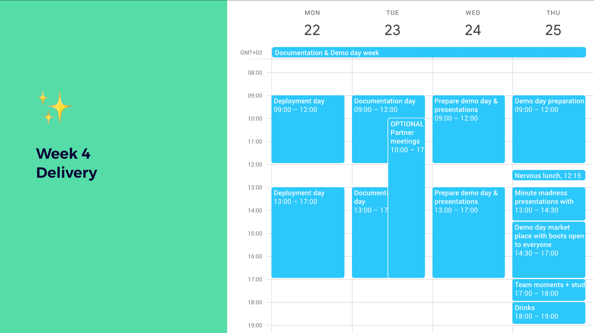

# Delivery week — week 4

## Who does what

### Organisational

* Gather documentation
* Closing \(reception\)

### Partners

* Visit teams & demo day

### Coaches 

* Guide teams
* Demo day
* Make sure deployment, documentation and pitching goes well
* Do retrospect at the end

### Students:

* Document project
* Deploy project
* Select target groups
* Prepare demo day
* Prepare pitch
* Present projects to partners

