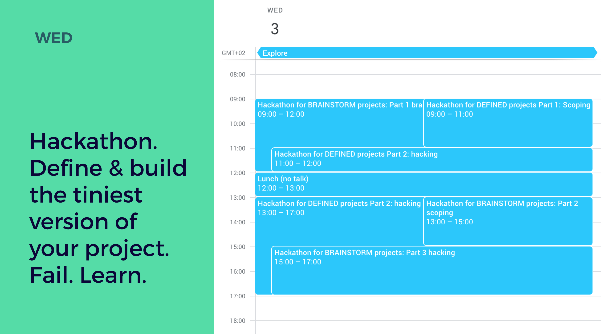

# Hackathon day 2 — 4

## Example structure

1. Teams prepare client meeting \(day 1 and 2\) - Get briefing from coach - Prepare questions and meeting
2. Teams meet with client \(day 2\) - Ask questions, take notes, ask input
3. Teams prepare hackathon \(day 2\) - Set up dev environment - Read up on briefing, study client - Prepare battle plan
4. Brainstorm \(day 3, but not for well-defined projects\) - Only for projects that need brainstorming for their project
5. Scope \(day 3\) - Define what you're going to build during the hackathon.
6. Hack \(day 3 for well-defined projects, day 3 and 4 for brainstorm projects\)
7. Present to other teams \(day 4\)
8. Feedback from other teams \(day 4, but not for brainstorm-type projects\). Clients can see the result on the next client meeting.

A more detailed agenda can be found on the website.

Belgium: [https://2019.summerofcode.be/practical.html](https://2019.summerofcode.be/practical.html)  
Spain: [https://2019.summerofcode.es/whoweare.html](https://2019.summerofcode.es/whoweare.html)

### Day 2

### Day 3

### Day 4

