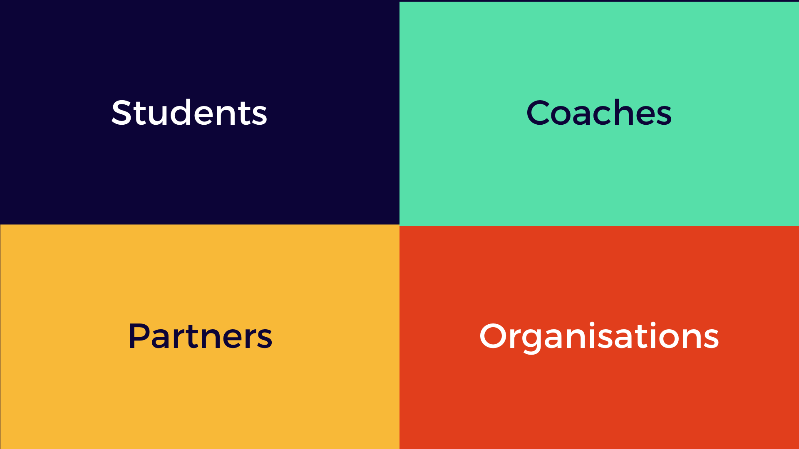

# How to set up Osoc for your country

## 4 stakeholders, 1 goal

Facilitate innovative open source projects, made by incredibly motivated students, coaches & partners.

We'll be giving you a step-by-step guide to set up a successful Open summer of code edition.

