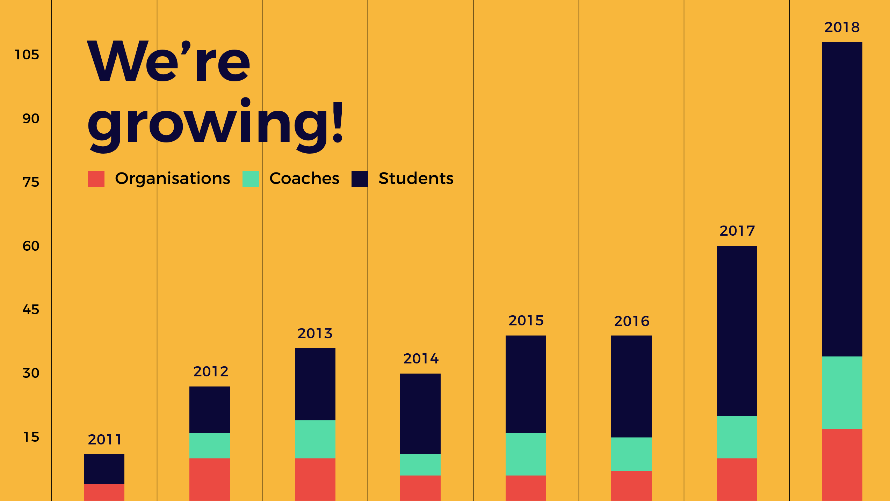

# Taking over the world

Contact us to take on the challenge to start your own oSoc in your country! [info@osoc.be](mailto:info@osoc.be).

We have a nice hockey stick curve, and are already active in Belgium and Spain — and we're working on the Netherlands and other countries as well!

Resources you can use:

* Our oSoc website [https://github.com/oSoc19](https://github.com/oSoc19)
* Our knowledge base \(this website\)
* Our programme
* Branding & logo

Get in touch with us on how to use these resources and where to find them.

