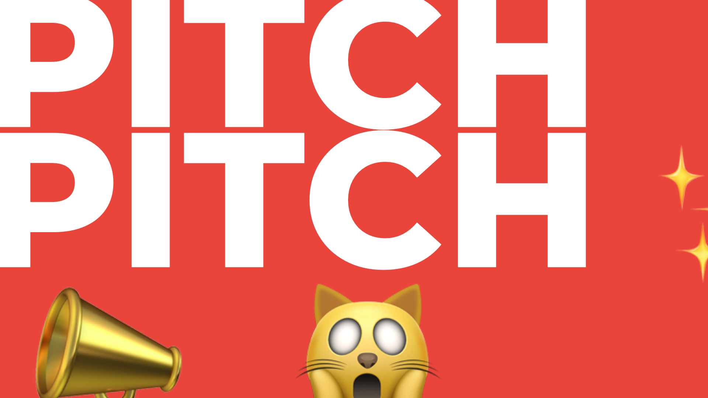
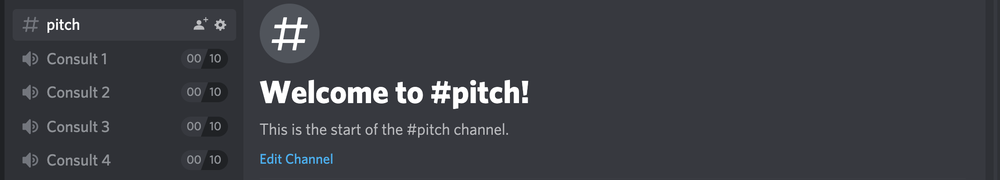
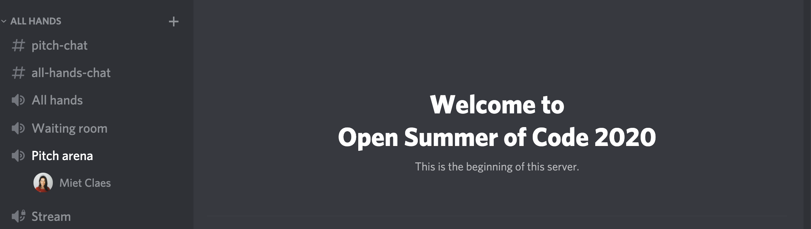
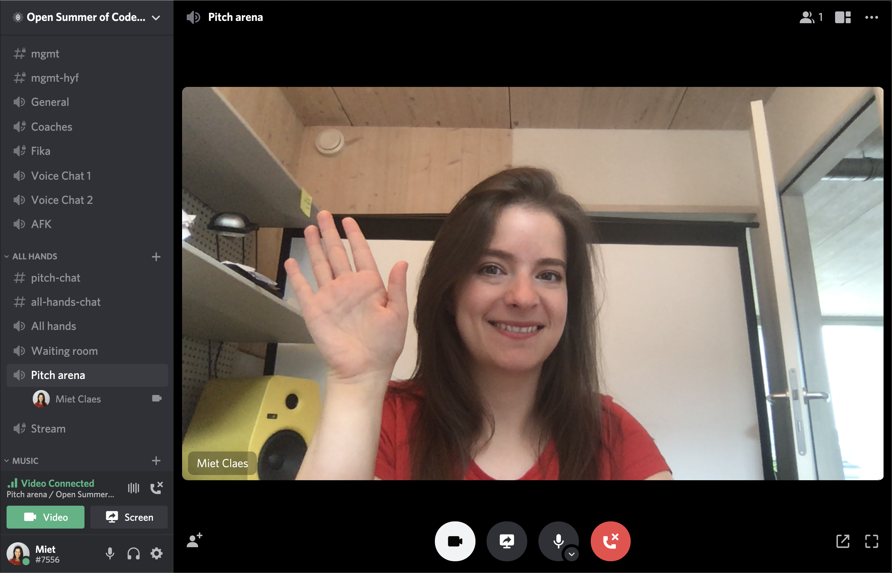
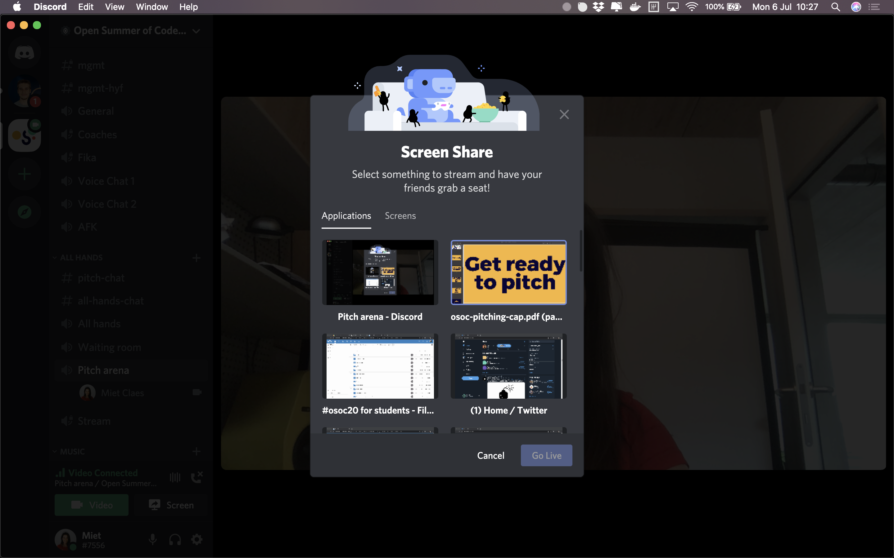
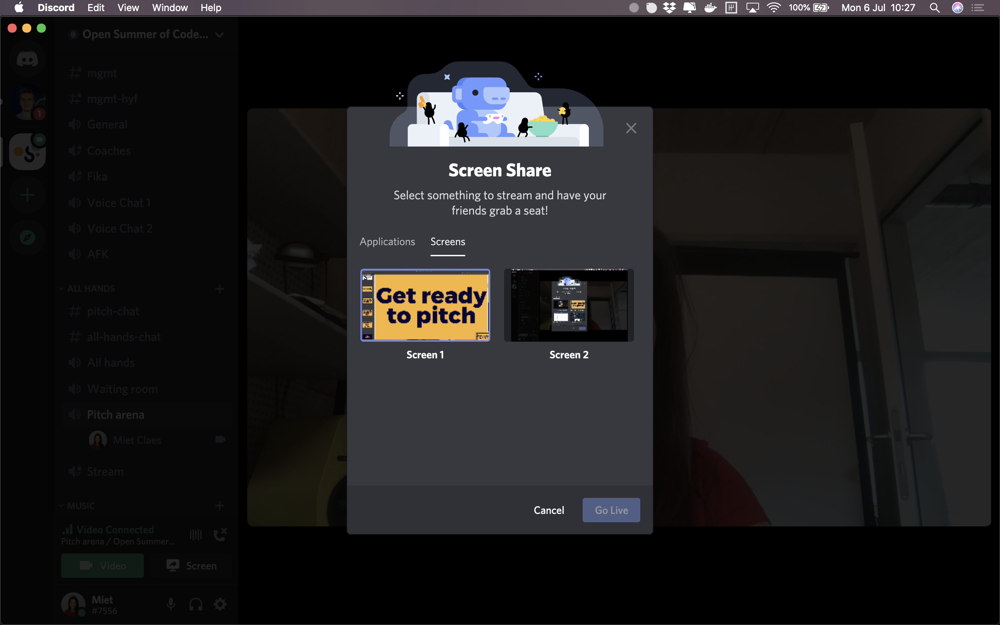
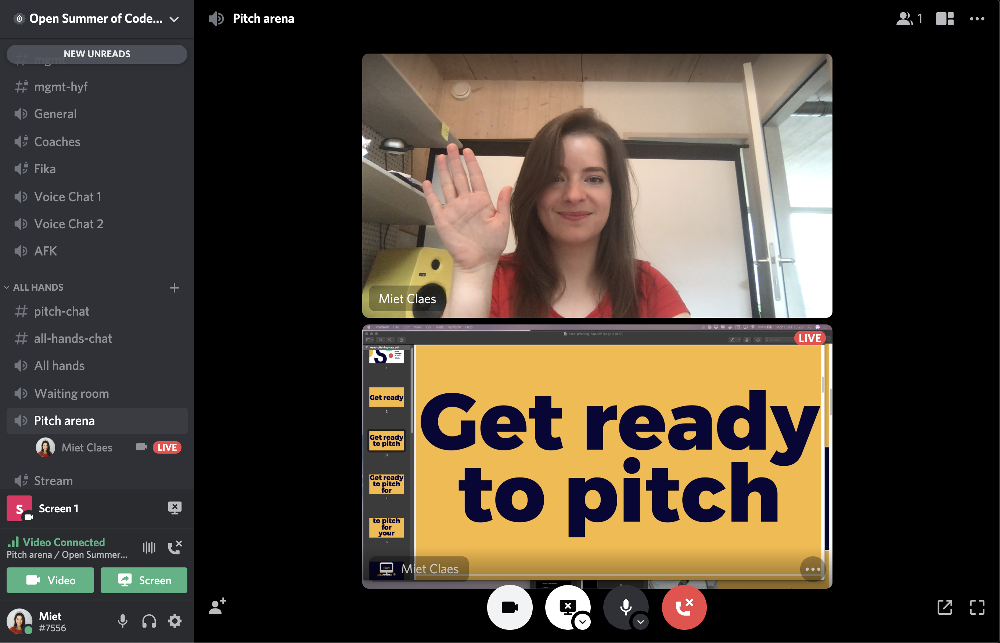
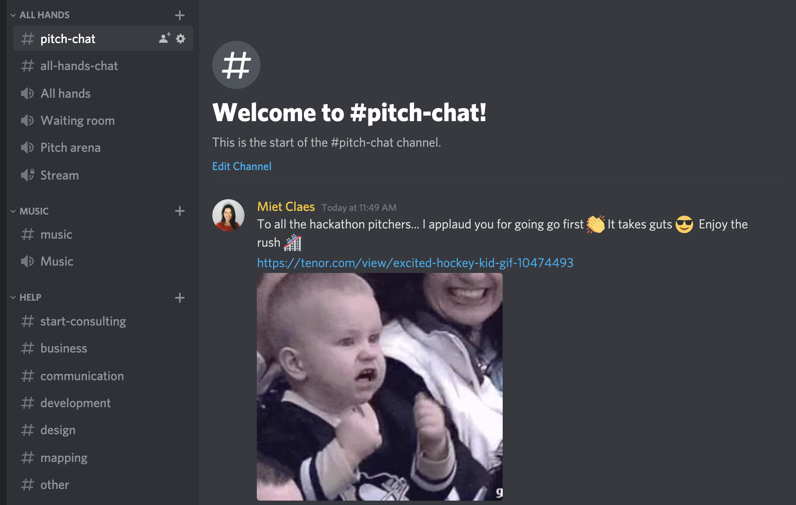

# Hackathon pitches

## The sequence

### Up first

We will kick off with the pitch of the osoc communications team! They will tell you all about themselves and what they need from you this year 😉

### Up next

We have 3 tracks this year, and we will present them like this:

1. **Science & Innovation**
   1. Fast and Slow
   2. FRIS
   3. Job match
   4. Shmdoc
   5. RML.io Dashboard
   6. HYF alumni platform
2. **Culture & Society**
   1. Bitoftrust
   2. Bridges
   3. Heritage Quality Control 
   4. Simplification of election procedures
   5. Citizen project 1
   6. Citizen project 2
   7. Urban Brussels
   8. Fitigai
3. **Commute & Travel**
   1. NMBS Route Planner 
   2. Serendipity Engine
   3. Bike Data
   4. Data inventory


If you decided to change your name, please change it in the channel and in the nextcloud folder for students as well! [https://cloud.openknowledge.be/s/8QHH7oXRSWpY8eK](https://cloud.openknowledge.be/s/8QHH7oXRSWpY8eK)


## Where to pitch: on discord

We will live stream the pitches again; live from Discord.

### 1. Pick your pitcher

Pick who will pitch first for your team! Let us know who it will be here: [https://docs.google.com/spreadsheets/d/1LEOFnsOYX1sOJuNBzhD277bCgdci9O\_vAOphsx2vnGE/edit?usp=sharing](https://docs.google.com/spreadsheets/d/1LEOFnsOYX1sOJuNBzhD277bCgdci9O_vAOphsx2vnGE/edit?usp=sharing)

Don't worry, everybody gets to pitch...

### 2. Prep your pitch

If you need any help, ask your colleagues on Discord in the \#pitch channel in the category help.

### 3. At 15:30 the first pitcher goes to the voice channel _Waiting Room_, and the others follow

This will be the osoc team. **When the first pitcher is pitching, the second pitcher goes to the waiting** room. Keep an eye on the sequence, don't miss a beat! [Hackathon pitches: up next](hackathon-pitches.md#up-next).

🔕 Mute your notifications.

### 4. You will be introduced to the Pitch arena \(magically\)


**🔇When you are in there, please mute the osoc pitch stream \(YouTube\) so we do not create a feedback loop!**


### 4. Turn on your camera


If you have a mac, make sure Discord has permission to your camera and your screen in your settings! Test this in advance. Go to the channel \#practical-questions if you don't know how.


If you do not have a functional camera, don't worry, we'll figure out how to fix that later.

If you want to show us something, you can by showing us your screen. Pick a specific application to just show one app, and pick "screens" if you want to show multiple screens.

### 5. When you're done, disconnect and enjoy the rush 🔥

### 6. Listen to your other colleagues

See your colleagues shine on our livestream and bring your enthusiasm to the \#pitch-chat channel. No need to give feedback yet, just make sure they feel empowered to be there 🔥 It takes some guts to go first.


Be nice, pay attention or else 😬!


