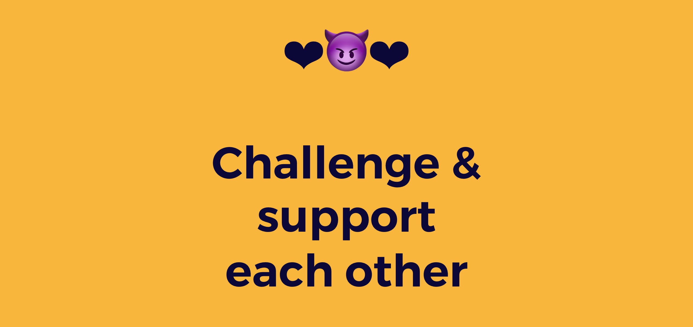

# Code of Conduct

The code of conduct applies to all attendees of Open Summer of Code, paid and unpaid, except for the enforcers \(cf. section A, paragraph 9\). Please read these rules carefully. If you infringe on one of them, you must fulfil a task from the punishments section, C.

No worries, we also have an achievements section. When we think you did a great job, there are some props to earn.

## **A. Code of Conduct**

### **§1 Git\(Hub\)**

1. Git is considered to be known.
   1. Devs \(front, back, AI, ...\) have to know how to develop with it
   2. All other profiles need to know how to create issues — but learning git is a _huge_ plus!
2. You will not commit a config file.
3. You will use branches for development code you’re working on, as explained at the Git 101. You’re free to ask for extra help when doing it.

### **§2 Gear**

1. You bring your own laptop.
2. You will not forget your battery charger. Ever.
3. Everything you use or borrow, must be returned in the same state as before.
4. You will lock your computer when leaving your desk.

### **§3 Location and work hours**

We have strict rules for the location:

1. Clean up your desk before leaving \(aka the clean-desk policy\).
2. Do not leave anything precious when you are not around.
3. Respect the building and area. Keep it clean, throw garbage in the bins, etc.
4. If someone from the partner organisations enters the room and has something to say, you stop all work and listen \(or at least, pretend to\).
5. You are at least 8 hours a day present at this location. You are welcome to fulfil these hours between 8am and 7pm. If you want to work late let us know. Specific locations might require special badges or a supervisor in order to be able to work past 7pm.

If you cannot work 8 hours during a certain day, you should mail [astrid@openknowledge.be](mailto:astrid@openknowledge.be) at least 2 days in advance \(cases of emergency excluded\).

### **§4 Your work**

1. You will document everything. All documentation has to be written in English.
2. You will do your work to the best of your efforts.
3. Your work is, unless, in some very rare cases stated otherwise, open source and will be shared with your neighbours, working towards a best-effort cross pollination policy.
4. Projects are copyrighted 2019 by Open Knowledge Belgium, the author is you. At the top of every file there should be a copyright notice and author notice, before committed to the GIT repository.
5. If you find yourself stuck with work for more than 2 hours, you will ask for help.
6. All PHP projects use the PSR-2 code standard. More info @ [https://github.com/php-fig/fig-standards/blob/master/accepted/PSR-2-coding-style-guide.md](https://github.com/php-fig/fig-standards/blob/master/accepted/PSR-2-coding-style-guide.md). For other programming languages, coding standards must be followed.
7. Your code should not allow SQL-injection, XSS-ing, etc
8. Whenever you’re about to write a 300+ line file, you first ask yourself whether you would need a rewrite and if you don’t think so, you ask the permission to commit the file from a dev coach.

### **§5 You’re an ambassador**

1. During the event, interest\(ing\|ed\) people \(e.g., journalists, potential employers, experts\) may enter the location. When they’re asking about your project, cease work and answer them in a best-effort way.
2. Everyone in your team is an ambassador of the project, without exception \(yes, also the back-end coder\). You will explain your project with pride and will train yourself to pitch the project as if it was your start-up.
3. The project doesn’t end at the last day of \#oSoc19. You should try to “design” your open source project that it becomes a win for you when you are asked to pitch your project later on, or when you’re contacted by journalists, asked to attend an event, and so forth.

### **§6 Communication**

1. All official communication, documentation and so on has to be done in English. You are free to speak your native language when talking to your neighbour. From the moment you’re in a group with someone who does not speak the same language, you switch to English.
2. Our communication manager and coaches are responsible for the general management across and between the different projects. When they ask you to do something, you drop all work and help them in a best-effort manner.

### **§7 What's in a name**

1. You must refer to our event as \#oSoc19 or “open Summer of code”
2. The “open Summer of code” is written with one capital S. All other letters are lowercase \(except in case of the beginning of a sentence\). Always.

### **§8 Blog**

1. You are encouraged to write a blog post or vlog about the project you’re working on during the open Summer of code. Ask our communication manager about it.
2. As said before, all communication happens in English, therefore also the blog/vlog. We don’t expect complete articles or movies, to explain the progress of your project is enough. Feel free to ask for help from our communication and project managers.
3. People like pictures, don’t be afraid to take photographs or add some images to the blog post or online messages.

### **§9 Enforcers**

The [board members of Open Knowledge Belgium](http://be.okfn.org/okbe/) and the coaches \(not student coaches\) are the enforcers of this code of conduct.

1. The enforcers are above this code of conduct; they cannot be punished.
2. The board members of Open Knowledge Belgium are free to change the code of conduct at any time. When changes take place, all open Summer of code members will be informed. The last, true, version of the code of conduct is available at [https://help.osoc.be/global/students/the-student-job/code-of-conduct](https://help.osoc.be/global/students/the-student-job/code-of-conduct).
3. Coaches, as mentioned in **section D**, can enforce the code of conduct. When in doubt, you can contest charges from a coach to someone of the board.

## **B. Punishments**

When you infringe on one of the rules, you must choose one punishment.

* P1: Buy drinks for the team of the person that spotted your infringement — and yourself. Drink it together.
* P2: Get ice cream for the team of the person that spotted your infringement — and yourself. Brain freeze together.
* P3: Give the person that spotted your infringement a token, to thank them \(cfr. section B\). If you have no tokens left, choose from P1 or P2.

Infringing  on one of the rules multiple times does not grant you remission at any time.

## C. oSoc Tokens

At the beginning of oSoc, you'll be given a set of tokens. These are your oSoc lives. They can be used for three things:

* Showing respect.
* Showing gratitude.
* Bailing you out of a punishment — see punishments in section B.

## D. Achievements

There are lots of achievements to obtain. Here’s a hint on what we’re scoring you, on the final day we’ll hand over some cool badges to the winner\(s\) of each part.

You'll be asked to vote for your fellow students, for the following achievements:

1. GitWizard = Wizard of contributions & commits
2. BlogMaster = Master of the digital written word
3. The Dribbbler = Their designs are dripping in gold
4. The People Whisperer = The U in UX. Such user friendly designs
5. The Presentator = A true Erlich Bachmann
6. The Investigator = Nobody can keep a secret from them — their research skills are incredible!
7. Santa's Little Helper = They're always here to help out people, even if those people not in their team
8. Multilingual Beep Beep = Uses so many code languages
9. Multilingual Human = Uses so many human languages
10. The Generalist = Knows something about everything
11. The CEO = A young Larry Page
12. The Apprentice = Learner of skills and magic
13. The Carebear = They take care of their team
14. Little Sunshine= Always look on the bright side of life
15. Early Bird = FIRST
16. The Vampire = Feels much better working at night
17. Determinator = You've got your eyes on the prize, dedicated to get to that deadline and you make every minute count
18. The Motivator = Whenever we're down, we call on you our friend!
19. Silent But Deadly = The driving but quiet force
20. Ms./Mr. Propre = You reinvented the clean desk policy
21. MVP = We’ll recommend the s\*\*t out of you afterwards

Some achievements you can only get by chance:

1. The Punisher = Got the most tokens left. Or you're wonderful at helping people, or you're very good at spotting infringements...
2. The Rascal = Got the least amount of tokens left. Or you actually _got the guts_ to go out and ask for help unlike your colleagues, or you were a true rule "bender"...

## **E. Your freedoms**

### **§1 Freedom to change projects**

If you don’t feel at ease in your team, or you feel there’s a serious mismatch with your project, we will try to switch you with someone from another project who has a similar role and skill set. Please send an email to astrid@openknowledge.be or talk to Astrid in person.

### **§2 Freedom of tools**

Except for Git and SSH, you are free to use any software or hardware stack that you are accustomed to.

Our servers can run most Linux distributions you’d want to use. You can use them to set up and any technology stack best suited to your project. All we need is your SSH key and you can set things up yourself.

### **§3 Freedom to learn**

1. You cannot know everything. You are free to ask questions to anyone on another project who seems to have the best expertise on that subject.
2. You are free to request any project’s source code.

### **§4 Freedom to work whenever you’re most productive**

You are requested to attend oSoc 8 hours a day, which you are free to choose from the hours the location is open. As long as you are capable to deliver at every milestone and you're there when your team or client needs you, you’re safe.

### **§5 Freedom of speech**

You are free to tweet, using the proper hashtags \#oSoc19, use Facebook, Instagram, SnapChat, or any other social network, whenever you want to say anything about oSoc. As long as you're not harassing or hurting other people.

You can tweet about anything on social media, but if there are any issues come to us first!

### **§6 Freedom of information**

Open Knowledge Belgium aims to be 100% transparent. Therefore you can request any kind of non-privacy-prone information about the non-profit organisation and the open Summer of code event. Visit [be.okfn.org](http://be.okfn.org/) for more details.

  
  
  

  

