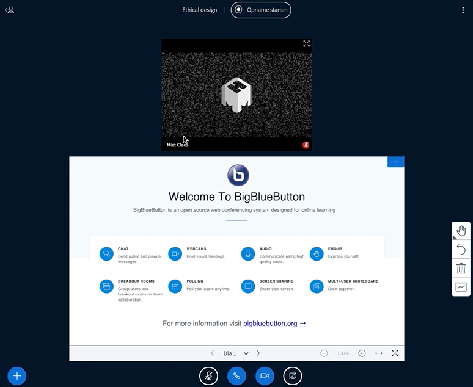

# Big Blue Button: Video Calls


If this guide does not help, please get in touch with Astrid or Miet. It's possible we need to provide a different solution for your team!


## Enter the Room

When clicking the link, you'll see a landing page that requests you to **enter your name**. **Click "Begin"** to enter the room.


Mac users: make sure you allow Big Blue Button to see your video, audio and that you can share your screen!&#x20;


## Audio

### Connect to the Audio

You can choose to listen only; or to connect your microphone. **In meetings we recommend joining with your microphone (microfoon)**; for attending talks listening only is fine too.

While you wait, it connects to an echo test...

.png>)

The echo test shows a thumb up and a thumb down. **Speak or make a sound, and if the echo test works, you'll hear it back.** Press thumbs up if it worked.

### Disconnecting from Audio: disable sound and voice

If you don't want to hear anyone, and don't want people to hear you anymore – you can **click "leave audio" (audio verlaten)** in the bottom bar. This will disconnect your microphone and sound.

### Getting your Audio back

Getting back in is easy; **click the phone icon that says "deelnemen aan audio"** in the bottom bar. This will allow you to get back to the [echo test](big-blue-button-video-calls.md#connect-to-the-audio) and connect to the audio.

## Presenting Your Screen

### Take the Presenter Role

To be able to share your screen, you need to **take the presenter role first**. Watch out, if someone else is sharing their screen – you'll take that away!

### Share Your Screen

When you have the presenter role, you can now share your screen with the **button "Deel uw scherm" below**.

### Resizing the Shared Screen

You can make shared presentations and shared screens bigger by **dragging** the screen right above the shared presentation or screen.

## Camera

To turn on your camera, **click the camera icon that says "webcam delen"** in the bottom bar.&#x20;

## In-depth Instruction Videos



## Devices, browsers, requirements


