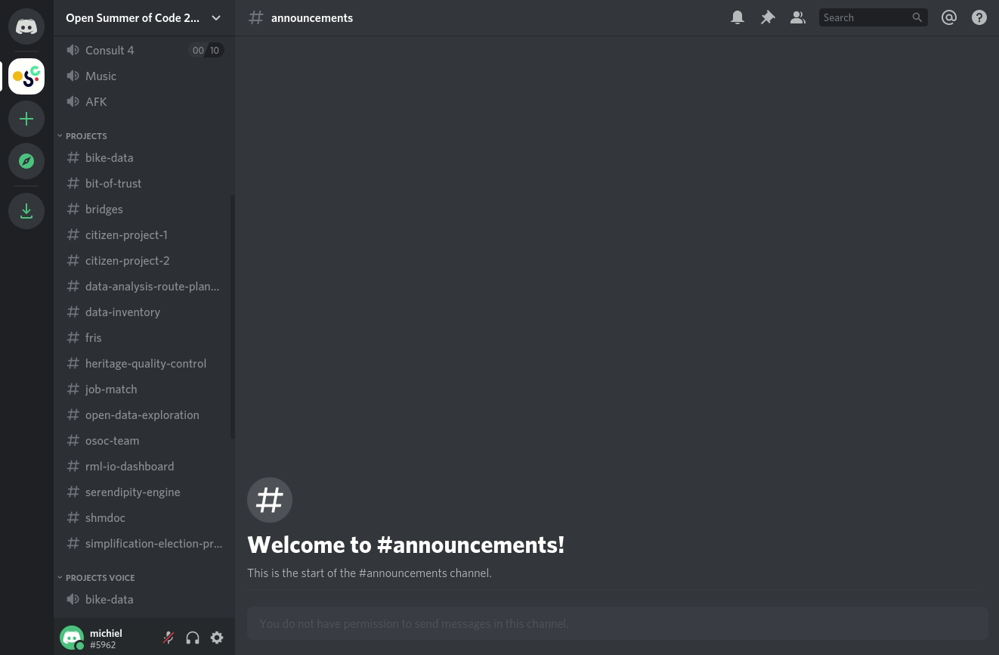
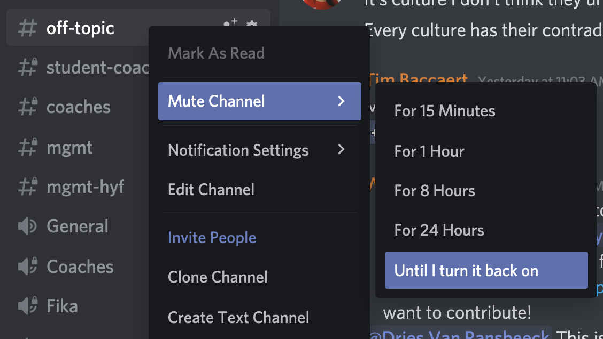
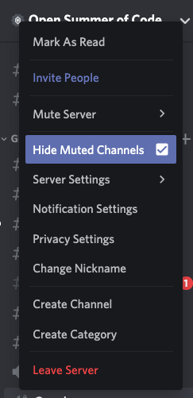

# Managing notifications

On Discord, you have fine-grained control over which notifications you receive at which time.


**Leave mentions for @everyone and @here on.** The only people who can use these are in the coordination and communication team, and it's what we'll use when we need to be sure you read a message.


## **Only receive notifications when you're mentioned**

## **Channel-Specific Notifications**

For the ones you're interested in, such as your project chat:

To keep getting notifications without getting a notification sound or your operating system's notification message pop-up, you can [turn on Do Not Disturb mode](https://support.discord.com/hc/en-us/articles/227779547-Changing-Online-Status).

## **Hide channels and categories in the left side panel**

For channels you are not interested in, and to de-clutter your side panel.

### Step 1: mute the channel

### **Step 2: Right-click on "open summer of code" \(Channel name\) & click "Hide Muted Channels"**

You will now only receive a notification whenever people mention you.

