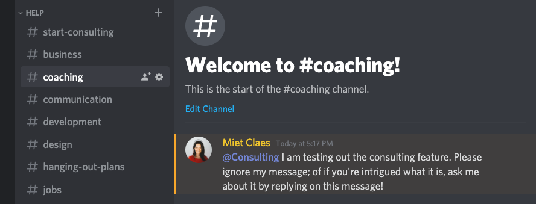

# Offering and Receiving Help

## Asking for Help from Anyone

We have a bunch of help channels in Discord. Got a question? Pop in in there. Someone might pick it up 👀.

## The Rubber Duck Debugging Technique

Have you ever asked someone a question, and by asking it, and then you realise you know the answer? Let's avoid the awkward _"Oh never mind.. sorry"_ moment by using the [Rubber Duck Debugging technique](https://en.wikipedia.org/wiki/Rubber_duck_debugging)!

You take rubber \(or imaginary\) duck, and you explain the problem. Out loud. Yes, really. Observe how talking to yourself makes you smarter.

Couldn't figure out find the answer? [Ask in one of the help channels](remote-helping.md#asking-for-help-from-anyone) or [consult a coach](remote-helping.md#asking-for-help-from-coaches)!

You can read more about this technique on [Wikipedia](https://en.wikipedia.org/wiki/Rubber_duck_debugging) – specifically for development. However, it's also useful for problems, like finding out how a certain tool works. Try it and let us know if it worked!

## Asking for Help from Coaches

Whenever a someone types "@consulting" in one of the help channels, while you set yourself on available, you get a notification. If you can help out, you can just react on that message!

## Making Yourself Available to Help as a Coach

As a coach, whenever you have some time off _– AKA letting your students go 🔥_, you can offer your time to help out students by clicking the hand emoji in the help channel \#start-consulting.


Aim to be available to people outside of your team approximately for one hour a day \(fulltime coaches\) or half an hour a day \(halftime coaches\).


Even if you're not actively consulting, and you see a message pop up in one of the help channels, you don't have to hold back. Open summer of code was built on people helping each other out!

