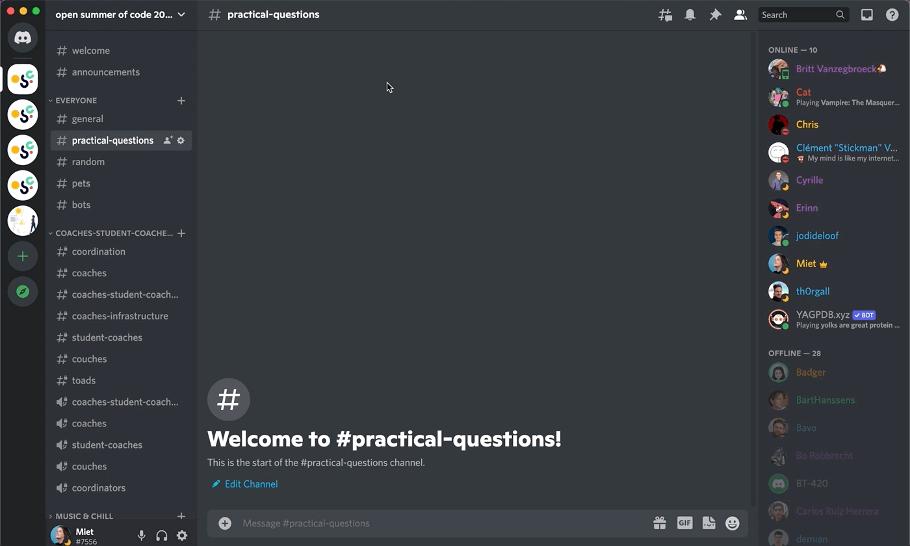

# Setting your nickname & description

At Open Summer of Code, we'd like you to set your nickname to your full name (only for our server). This way we know it's you and not someone outside of our organisation.

You can set your name for the **#osoc server specifically**, like this:

You can edit your description here, for all servers (not just the osoc one) like so:

When you have Nitro you can pay for certain extra's such as editing your description server per server, but we do not reimburse this.
