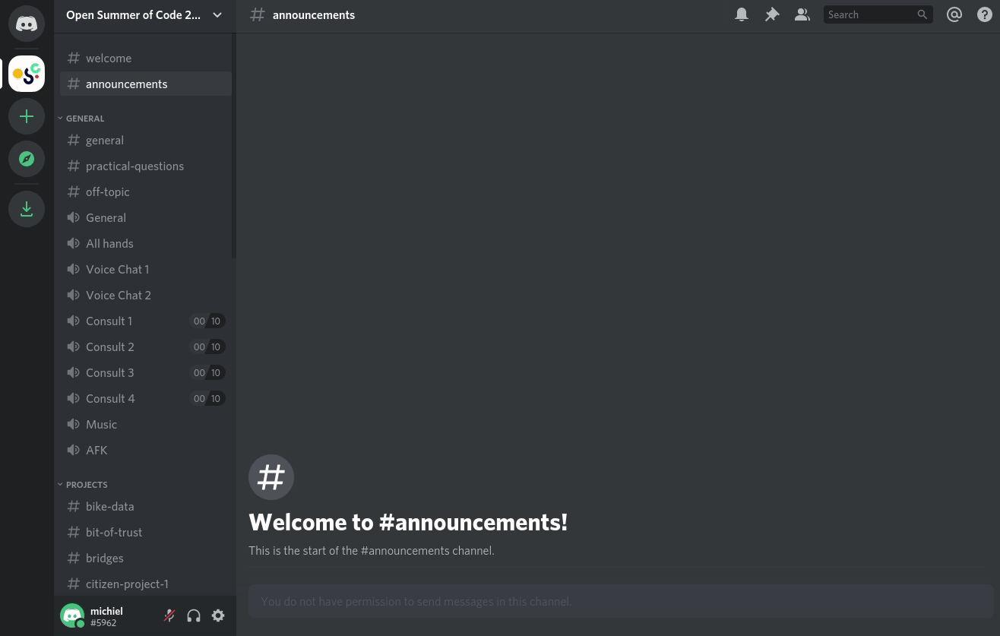

# Setting your nickname

At Open Summer of Code, we'd like you to set your nickname to your full name \(only for our server\).

You can set your name for the \#osoc server specifically, like this:

