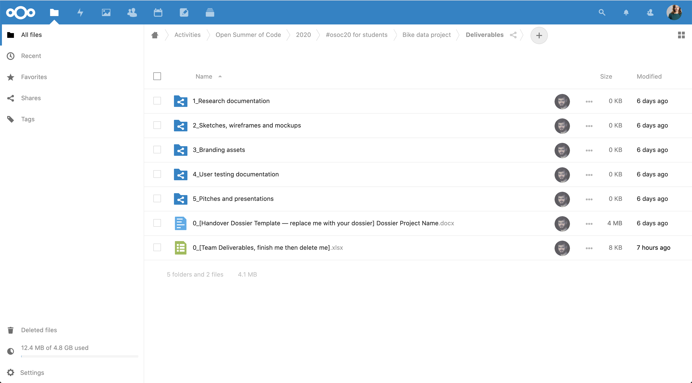

# NextCloud

You can find your team folder in the osoc20 folder for students: [https://cloud.openknowledge.be/s/8QHH7oXRSWpY8eK](https://cloud.openknowledge.be/s/8QHH7oXRSWpY8eK)

## \_Underscore files and folders

Folders and files with an \_underscore are used to gather information from you

## Team folder

Your team folder is used to gather your team's work, and to collaborate \(for instance in emails\)

## Deliverables

Your deliverables folder is used to hand over to the client.

Make sure, before you send it over in the last week, you remove the excel sheet with your todo's, and rename the handover document.

