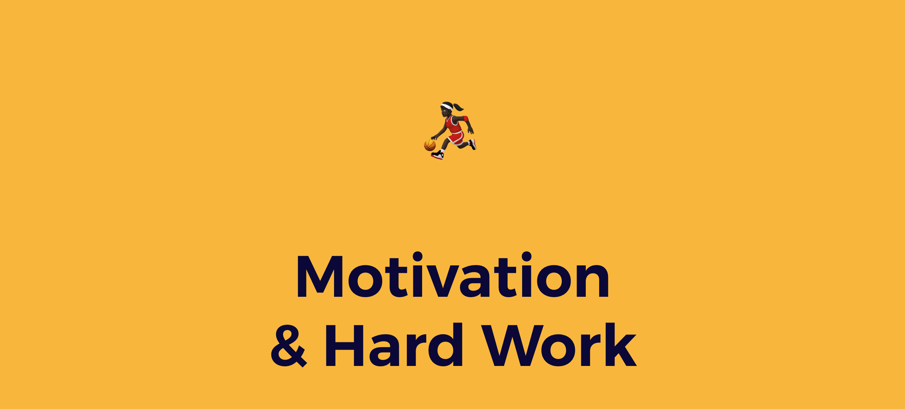

# The osoc Way of Work & Play

## **How We Work**

### **§2 Gear \(for on-site editions\)**

1. You bring your own laptop.
2. You will not forget your battery charger. Ever.
3. Everything you use or borrow, must be returned in the same state as before.
4. You will lock your computer when leaving your desk.

### **§3 Location and work hours**

#### Remote edition

1. During COVID19 remote will be the default. Work from home or a location that provides you with a good working environment. If there is no suitable working place available to you, please get in touch [dries@openknowledge.be](mailto:dries@openknowledge.be).
2. We work 8 hours per day. We do not expect you to work more than that.
3. You are welcome to fulfill these hours between 8am and 7pm.
4. Make sure you attend planned activities with teams, clients and in group  \(such as streams, meetings and standups\) as communicated in the calendar and by your coach.

If you cannot work 8 hours during a certain day, you should mail [dries@openknowledge.be](mailto:dries@openknowledge.be) at least 2 days in advance \(cases of emergency excluded\).

#### On-site edition

1. Clean up your desk before leaving \(aka the clean-desk policy\).
2. Do not leave anything precious when you are not around.
3. Respect the building and area. Keep it clean, throw garbage in the bins, etc.
4. If someone from the partner organisations enters the room and has something to say, you stop all work and listen \(or at least, pretend to\).
5. You are at least 8 hours a day present at this location. You are welcome to fulfil these hours between 8am and 7pm. If you want to work late let us know. Specific locations might require special badges or a supervisor in order to be able to work past 7pm.

If you cannot work 8 hours during a certain day, you should mail [dries@openknowledge.be](mailto:dries@openknowledge.be) at least 2 days in advance \(cases of emergency excluded\).

### **§4 Your work**

1. You will document everything. All documentation has to be written in English.
2. You will do your work to the best of your efforts.
3. Your work is, unless, in some very rare cases stated otherwise, open source and will be shared with your neighbours, working towards a best-effort cross pollination policy.
4. Projects are copyrighted 2019 by Open Knowledge Belgium, the author is you. At the top of every file there should be a copyright notice and author notice, before committed to the GIT repository.
5. If you find yourself stuck with a problem for more than 1 hour, you will ask for help.

### **§5 You’re an ambassador**

1. Only for on-site editions: During the event, interest\(ing\|ed\) people \(e.g., journalists, potential employers, experts\) may enter the location. When they’re asking about your project, cease work and answer them in a best-effort way.
2. Everyone in your team is an ambassador of the project, without exception \(yes, also the back-end coder\). You will explain your project with pride and will train yourself to pitch the project as if it was your own start-up.
3. The project doesn’t end at the last day of \#osoc20. You should try to “design” your open source project that it becomes a win for you when you are asked to pitch your project later on, or when you’re contacted by journalists, asked to attend an event, and so forth.

### **§6 Communication**

1. All official communication, documentation and so on has to be done in English. You are free to speak your native language when talking to your neighbour. From the moment you’re in a group with someone who does not speak the same language, you switch to English.
2. Our communication manager and coaches are responsible for the general management across and between the different projects. When they ask you to do something, you drop all work and help them in a best-effort manner.

### **§7 What's in a name**

1. You must refer to our event as \#osoc20 or “Open summer of code”

### **§8 Blog**

1. You are encouraged to write a blog post or vlog about the project you’re working on during the open Summer of code. Ask our communication manager about it.
2. As said before, all communication happens in English, therefore also the blog/vlog. We don’t expect complete articles or movies, to explain the progress of your project is enough. Feel free to ask for help from our communication and project managers.
3. People like pictures, don’t be afraid to take photographs or add some images to the blog post or online messages.

## **Your Freedoms**

### **§1 Freedom to change projects**

If you don’t feel at ease in your team, or you feel there’s a serious mismatch with your project, we will try to switch you with someone from another project who has a similar role and skill set. Please send an email to [dries@openknowledge.be](mailto:dries@openknowledge.be) or talk to Astrid in person.

### **§2 Freedom of tools**

Except for Git and SSH, you are free to use any software or hardware stack that you are accustomed to.

You are free to use any technology stack that is most suitable for your project and client.

### **§3 Freedom to learn**

1. You cannot know everything. You are free to ask questions to anyone on another project who seems to have the best expertise on that subject.
2. You are free to request any project’s source code.

### **§4 Freedom to work whenever you’re most productive**

You are requested to attend osoc 8 hours a day, which you are free to choose.

Make sure you attend planned activities with teams, clients and in group  \(such as streams, meetings and standups\) as communicated in the calendar and by your coach.

As long as you are capable to deliver at every milestone and you're there when your team or client needs you, you’re safe.

### **§5 Freedom of speech**

You are free to tweet, using the proper hashtags \#osoc20, use Facebook, Instagram, Snapchat, or any other social network, whenever you want to say anything about osoc. As long as you're not harassing or hurting other people. See [Code of Conduct](../code-of-conduct.md).

### **§6 Freedom of information**

Open Knowledge Belgium aims to be 100% transparent. Therefore you can request any kind of non-privacy-prone information about the non-profit organisation and the open Summer of code event. Visit [be.okfn.org](http://be.okfn.org/) for more details.

