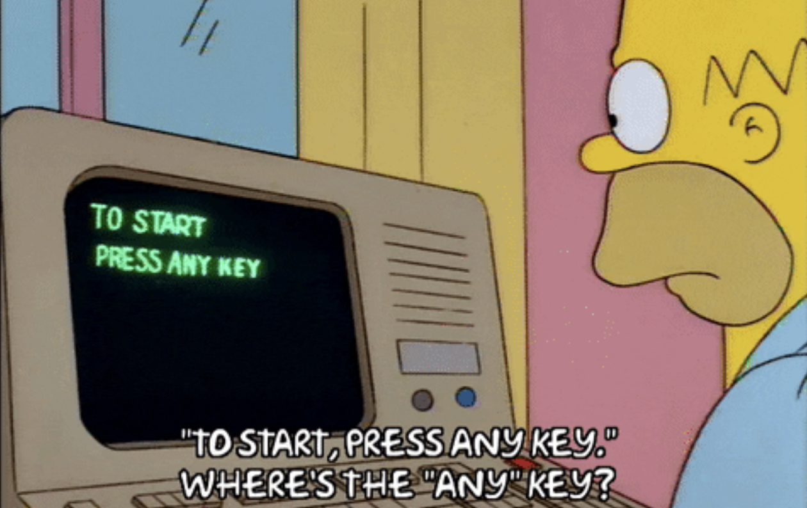
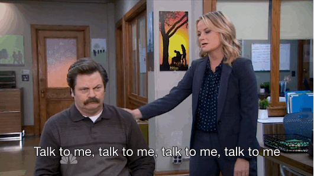
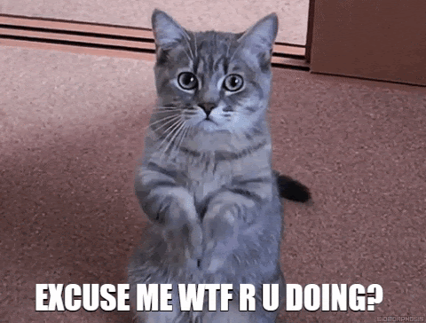
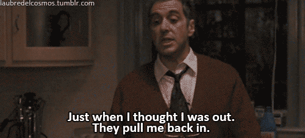
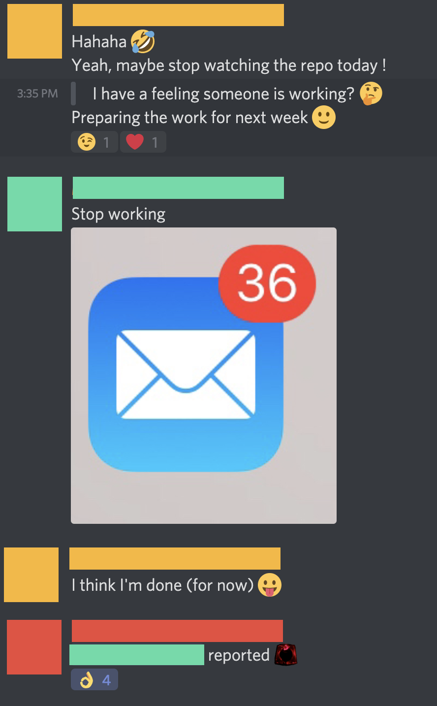

# Working Together in a Remote Setting

## 🎬 Where Do We Start?

This is the second time we are doing the remote setting; with each edition we will improve it! If you have any feedback; do get in touch. 

## 📣 Be Vocal

We can't see or hear each other all the time \(which is the case in a live setting\). So nobody will know when you're in doubt, or in need of help – if you do not speak up.

### Working Out Loud

Keep your teammates up-to-date on what you're doing. Update your tasks in your project management tool \(trello, kanban, github, ...\), hang out in the voice chats, perform daily standups, ... Whatever works for the team, just make sure you know what your teammates are doing and how they are doing!


Find a way to stay in touch and on top of work with your team. Some teams like to hang out in voice channels and play a tune, some teams like to greet each other every day and check in now and then. Find what feels good!


This also applies when in meetings; use your lovely osoc cards to react on video \(if sound is not suitable\) or use chat to confirm; there's nothing worse than talking into the void 🕳😅

In real life we nod or make listening sounds in conversations. Remote needs different ways of interacting!

### Ask for Help

Don't stay stuck in a loop for longer than 20 minutes. [There's plenty of ways to ask for help](../tools/discord/remote-helping.md), don't be afraid to ask for it! \#osoc was built on helping each other out, so we encourage you to ask and give help.

## 👔⚖️⛹🏽‍♀️ Work-Life-Balance

Working can be a lot of fun, and the team dynamics are exhilarating. However, it _is_ important to spend some time away from your screen; to reflect, recharge and give your brain some time to deal with the information throw at you every day.

Make your desk your work-environment. Keep it neat, so you can focus on what you do best; creating kick-ass projects.

Eat somewhere else if you can, even if it's only half a meter away \(we do not all have the luxury of different rooms, but if you can, go to a different room!\). You can definitely take walks, and let in some fresh air in your office too 🌬

### Take Regular Breaks


Regular breaks are a _must_. Make an agreement with your team on how you are going to take breaks. 👯‍♂️


### You Do Not Have to Overwork

You don't have to be online, constantly chatting with your team, 24/7. _**It's fine to disconnect**_, it's encouraged and healthy.

### Work Smoothly

Don't give 200% now, you'll be at 0% in the delivery week. Work at your own pace, so your colleagues can still count on you in the last week 🧘🏽‍♀️

## 🎳 Team Play

### Team Work Makes the Dream Work

We've selected you and your teammates because we think you have the right skills to bring this project to life, and each and everyone of you has value to offer. _**That means your teammates need you.**_ Take initiative and show us what you got!

Feeling a bit lost in your role? Speak up, ask for help! We are in this _together_.

### Take the Wheel

The team gets to make decisions, and we expect you to take initiative. Coaches are here to protect/help you when situations gets hard, and to make sure you don't steer into an iceberg; but you are in charge as a student.


Take ownership, stand up! This project and its outcome is yours 🔥


### Fun Fact: International Editions Are Possible When Remote

The upside of having a remote edition is that we can give international students or students that live in the outskirts of Belgium to take part in this edition. This gives us the chance to represent a broader audience as well, and reach more people.

## Exceptions to Remote Work

For the \#osoc20 and \#osoc21 edition, we think remote first.

### COVID-19 regulations

We follow Belgian regulations for the Belgian edition. At time of writing, they encourage working from home; which is why we made sure we have a remote edition.

Not everyone has been vaccinated yet. We don't want to put anyone at risk \(or put their family / house mates at risk\) – or make people feel left out \(similar to international students\).



### Exceptions

#### Teams

We can only allow an exception for teams if we keep the following factors in mind:

1. **The project requires on-site investigation to understand or build the project.** If you need help to jump the hurdle of digital teambuilding, please reach out – we unfortunately cannot allow an exception for teambuilding.
2. **The students in that specific project team agree.** Nobody should feel pressured, and everyone should feel safe. If some people are left out, consider how this will impact the team and their motivation – this also applies to teams with international students.
3. **Corona measures are followed** [https://www.info-coronavirus.be/en/faq/](https://www.info-coronavirus.be/en/faq/)

#### Individuals

If you do not have stable internet at home, we can offer you a seat at Be-Central in Brussels. Please get in touch beforehand, so we can coordinate and make sure it is safe for everyone.

We unfortunately cannot reimburse you for your travel expenses.

#### Travel reimbursements

_In progress._

#### Insurance

_In progress._

## 🌊💦🚰💧🧊 Stay Hydrated


Anything to add? Reach out to Miet on Discord.


